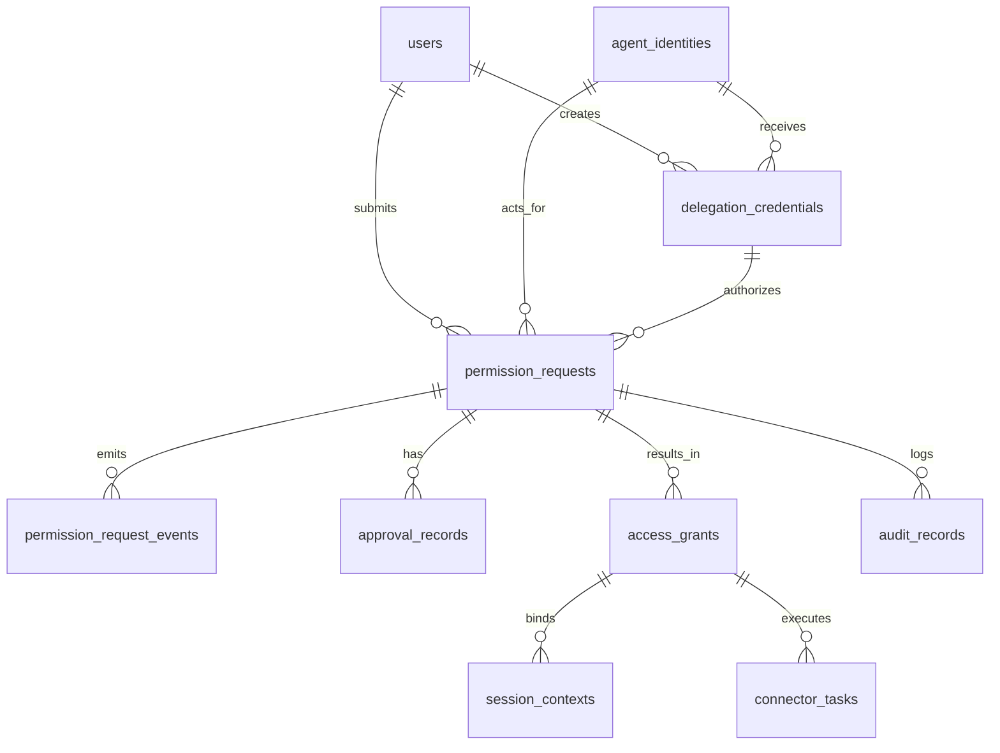

# 数据库设计文档

## 给 AI 发通行证：Agent 身份与权限系统 V1

| 项目 | 内容 |
| --- | --- |
| 文档名称 | Agent 身份与权限系统数据库设计文档 |
| 文档标识 | `docs/agent-identity-permission-database-design.md` |
| 当前版本 | V1.0 |
| 文档状态 | Active |
| 生效日期 | 2026-04-16 |
| 对应基线 | `docs/agent-identity-permission-srs.md` / `docs/agent-identity-permission-technical-design.md` / `docs/agent-identity-permission-development-guide.md` |
| 适用范围 | V1 数据库建模、迁移、测试数据、表结构实施 |

## 1. 文档目标

本文档用于定义 V1 阶段的数据模型、表结构、主外键关系、状态字段、索引、迁移顺序和归档策略，为后端建模、Alembic 迁移、测试造数和审计实现提供统一依据。

## 2. 设计原则

### 2.1 存储选型

- 主数据库使用 PostgreSQL 15+。
- 强一致业务数据全部落 PostgreSQL。
- Redis 仅用于缓存、分布式锁、热点会话与幂等键，不作为业务真源。

### 2.2 主键策略

- V1 业务主键统一使用应用层生成的前缀型字符串 ID，例如 `user_001`、`req_123`、`grt_001`。
- 数据类型统一使用 `varchar(64)`。
- 不在 V1 强制引入额外的自增内部键。

### 2.3 时间字段规范

所有核心表至少包含：

- `created_at timestamptz not null`
- `updated_at timestamptz not null`

按需要补充：

- `approved_at`
- `effective_at`
- `expire_at`
- `revoked_at`
- `processed_at`

### 2.4 枚举字段策略

- 业务状态字段统一使用受控枚举值。
- V1 数据库层使用 `varchar(32)` + `check constraint`，不直接使用 PostgreSQL Native Enum。
- 应用层枚举与数据库约束必须同步维护。

### 2.5 审计与事件优先

- 所有关键状态变化必须写事件表或审计表。
- 主表只存当前状态，历史过程由事件表承载。
- 安全关键写操作必须可还原“谁在何时因何做了什么”。

### 2.6 JSONB 使用边界

- 原始回调载荷、规则快照、扩展约束使用 `jsonb`。
- 不把核心查询条件全部塞进 `jsonb`。
- 关键筛选字段必须结构化建列。

## 3. 命名规范

### 3.1 表名

- 使用复数名词，例如 `users`、`permission_requests`。

### 3.2 主键与外键

- 主键命名统一 `*_id`。
- 外键字段直接采用被引用主键名，例如 `request_id`、`delegation_id`。

### 3.3 状态字段

- 申请主状态：`request_status`
- 审批状态：`approval_status`
- 授权状态：`grant_status`
- 会话状态：`session_status`
- 任务状态：`task_status`

### 3.4 索引命名

- 普通索引：`idx_<table>_<field>`
- 唯一索引：`uk_<table>_<field>`
- 外键约束：`fk_<table>_<ref_table>`
- 检查约束：`ck_<table>_<field>`

## 4. ER 总览

## 5. 状态与枚举设计

### 5.1 request_status

- `Draft`
- `Submitted`
- `Evaluating`
- `PendingApproval`
- `Approved`
- `Provisioning`
- `Active`
- `Expiring`
- `Expired`
- `Revoked`
- `Failed`

### 5.2 approval_status

- `NotRequired`
- `Pending`
- `Approved`
- `Rejected`
- `Withdrawn`
- `Expired`
- `CallbackFailed`

### 5.3 grant_status

- `NotCreated`
- `ProvisioningRequested`
- `Provisioning`
- `Active`
- `Expiring`
- `Expired`
- `Revoking`
- `Revoked`
- `ProvisionFailed`
- `RevokeFailed`

### 5.4 session_status

- `Active`
- `Revoking`
- `Revoked`
- `Syncing`
- `SyncFailed`
- `Expired`

### 5.5 task_status

- `Pending`
- `Running`
- `Succeeded`
- `Failed`
- `Retrying`
- `Compensating`
- `Compensated`

### 5.6 risk_level

- `Low`
- `Medium`
- `High`
- `Critical`

### 5.7 actor_type / operator_type

- `User`
- `Agent`
- `Approver`
- `ITAdmin`
- `SecurityAdmin`
- `System`

## 6. 核心表设计

### 6.1 users

**表用途**

存储企业用户主体及其基础组织信息。

| 字段 | 类型 | 可空 | 说明 |
| --- | --- | --- | --- |
| `user_id` | `varchar(64)` | 否 | 主键 |
| `employee_no` | `varchar(64)` | 是 | 工号 |
| `display_name` | `varchar(128)` | 否 | 用户显示名 |
| `email` | `varchar(256)` | 是 | 邮箱 |
| `department_id` | `varchar(64)` | 是 | 部门 ID |
| `department_name` | `varchar(128)` | 是 | 部门名称 |
| `manager_user_id` | `varchar(64)` | 是 | 直属主管 |
| `user_status` | `varchar(32)` | 否 | `Active` / `Disabled` |
| `identity_source` | `varchar(32)` | 否 | `SSO` / `Imported` |
| `created_at` | `timestamptz` | 否 | 创建时间 |
| `updated_at` | `timestamptz` | 否 | 更新时间 |

**索引与约束**

- `pk_users(user_id)`
- `uk_users_employee_no(employee_no)`
- `idx_users_department_id(department_id)`

### 6.2 agent_identities

**表用途**

存储平台内可治理 Agent 的身份、版本和启停状态。

| 字段 | 类型 | 可空 | 说明 |
| --- | --- | --- | --- |
| `agent_id` | `varchar(64)` | 否 | 主键 |
| `agent_name` | `varchar(128)` | 否 | Agent 名称 |
| `agent_version` | `varchar(32)` | 否 | 版本号 |
| `agent_type` | `varchar(32)` | 否 | V1 固定 `first_party` |
| `agent_status` | `varchar(32)` | 否 | `Active` / `Disabled` |
| `capability_scope_json` | `jsonb` | 是 | 能力边界 |
| `created_at` | `timestamptz` | 否 | 创建时间 |
| `updated_at` | `timestamptz` | 否 | 更新时间 |

**索引与约束**

- `pk_agent_identities(agent_id)`
- `idx_agent_identities_agent_status(agent_status)`

### 6.3 delegation_credentials

**表用途**

存储“用户 -> Agent” 的单层委托凭证。

| 字段 | 类型 | 可空 | 说明 |
| --- | --- | --- | --- |
| `delegation_id` | `varchar(64)` | 否 | 主键 |
| `user_id` | `varchar(64)` | 否 | 引用 `users.user_id` |
| `agent_id` | `varchar(64)` | 否 | 引用 `agent_identities.agent_id` |
| `task_scope` | `varchar(64)` | 否 | 任务范围 |
| `scope_json` | `jsonb` | 否 | 资源与动作范围 |
| `delegation_status` | `varchar(32)` | 否 | `Active` / `Expired` / `Revoked` |
| `issued_at` | `timestamptz` | 否 | 签发时间 |
| `expire_at` | `timestamptz` | 否 | 过期时间 |
| `revoked_at` | `timestamptz` | 是 | 撤销时间 |
| `revocation_reason` | `varchar(256)` | 是 | 撤销原因 |
| `created_at` | `timestamptz` | 否 | 创建时间 |
| `updated_at` | `timestamptz` | 否 | 更新时间 |

**索引与约束**

- `pk_delegation_credentials(delegation_id)`
- `fk_delegation_credentials_users(user_id -> users.user_id)`
- `fk_delegation_credentials_agents(agent_id -> agent_identities.agent_id)`
- `idx_delegation_credentials_user_agent_status(user_id, agent_id, delegation_status)`
- `idx_delegation_credentials_expire_at(expire_at)`

### 6.4 permission_requests

**表用途**

权限申请主表，是审批、开通、续期、回收与审计的统一索引中心。

| 字段 | 类型 | 可空 | 说明 |
| --- | --- | --- | --- |
| `request_id` | `varchar(64)` | 否 | 主键 |
| `user_id` | `varchar(64)` | 否 | 引用 `users.user_id` |
| `agent_id` | `varchar(64)` | 否 | 引用 `agent_identities.agent_id` |
| `delegation_id` | `varchar(64)` | 否 | 引用 `delegation_credentials.delegation_id` |
| `raw_text` | `text` | 否 | 用户原始申请文本 |
| `resource_key` | `varchar(128)` | 是 | 结构化资源标识 |
| `resource_type` | `varchar(32)` | 是 | 资源类型 |
| `action` | `varchar(32)` | 是 | 目标动作 |
| `constraints_json` | `jsonb` | 是 | 细粒度约束 |
| `requested_duration` | `varchar(32)` | 是 | 例如 `P7D` |
| `structured_request_json` | `jsonb` | 是 | 结构化解析快照 |
| `suggested_permission` | `varchar(256)` | 是 | 最小权限建议 |
| `risk_level` | `varchar(32)` | 是 | 风险等级 |
| `approval_status` | `varchar(32)` | 否 | 审批状态 |
| `grant_status` | `varchar(32)` | 否 | 授权状态 |
| `request_status` | `varchar(32)` | 否 | 主申请状态 |
| `current_task_state` | `varchar(32)` | 是 | 当前任务状态 |
| `policy_version` | `varchar(64)` | 是 | 策略版本 |
| `renew_round` | `integer` | 否 | 默认 `0` |
| `failed_reason` | `varchar(256)` | 是 | 最近失败原因 |
| `created_at` | `timestamptz` | 否 | 创建时间 |
| `updated_at` | `timestamptz` | 否 | 更新时间 |

**索引与约束**

- `pk_permission_requests(request_id)`
- `fk_permission_requests_users(user_id -> users.user_id)`
- `fk_permission_requests_agents(agent_id -> agent_identities.agent_id)`
- `fk_permission_requests_delegations(delegation_id -> delegation_credentials.delegation_id)`
- `idx_permission_requests_user_created_at(user_id, created_at desc)`
- `idx_permission_requests_status_updated_at(request_status, updated_at desc)`
- `idx_permission_requests_approval_status(approval_status)`
- `idx_permission_requests_risk_level(risk_level)`

### 6.5 permission_request_events

**表用途**

记录申请生命周期中的每次事件与状态变化。

| 字段 | 类型 | 可空 | 说明 |
| --- | --- | --- | --- |
| `event_id` | `varchar(64)` | 否 | 主键 |
| `request_id` | `varchar(64)` | 否 | 引用 `permission_requests.request_id` |
| `event_type` | `varchar(64)` | 否 | 事件名 |
| `operator_type` | `varchar(32)` | 否 | 操作方类型 |
| `operator_id` | `varchar(64)` | 是 | 操作方 ID |
| `from_request_status` | `varchar(32)` | 是 | 前态 |
| `to_request_status` | `varchar(32)` | 是 | 后态 |
| `metadata_json` | `jsonb` | 是 | 扩展信息 |
| `occurred_at` | `timestamptz` | 否 | 事件时间 |
| `created_at` | `timestamptz` | 否 | 写入时间 |

**索引与约束**

- `pk_permission_request_events(event_id)`
- `fk_permission_request_events_requests(request_id -> permission_requests.request_id)`
- `idx_permission_request_events_request_id(request_id, occurred_at desc)`
- `idx_permission_request_events_event_type(event_type)`

### 6.6 approval_records

**表用途**

记录审批实例、审批节点、审批结果和回调载荷。

| 字段 | 类型 | 可空 | 说明 |
| --- | --- | --- | --- |
| `approval_id` | `varchar(64)` | 否 | 主键 |
| `request_id` | `varchar(64)` | 否 | 引用 `permission_requests.request_id` |
| `external_approval_id` | `varchar(128)` | 是 | 飞书审批实例 ID |
| `approval_node` | `varchar(64)` | 否 | 审批节点 |
| `approver_id` | `varchar(64)` | 是 | 审批人 |
| `approval_status` | `varchar(32)` | 否 | 审批状态 |
| `callback_payload_json` | `jsonb` | 是 | 原始回调载荷 |
| `idempotency_key` | `varchar(128)` | 是 | 回调幂等键 |
| `submitted_at` | `timestamptz` | 是 | 发起时间 |
| `approved_at` | `timestamptz` | 是 | 通过时间 |
| `rejected_at` | `timestamptz` | 是 | 驳回时间 |
| `created_at` | `timestamptz` | 否 | 创建时间 |
| `updated_at` | `timestamptz` | 否 | 更新时间 |

**索引与约束**

- `pk_approval_records(approval_id)`
- `fk_approval_records_requests(request_id -> permission_requests.request_id)`
- `uk_approval_records_external_approval_id(external_approval_id)`
- `uk_approval_records_idempotency_key(idempotency_key)`
- `idx_approval_records_request_id(request_id)`
- `idx_approval_records_status(approval_status)`

### 6.7 access_grants

**表用途**

记录授权开通、生效、续期、到期、撤销和对账状态。

| 字段 | 类型 | 可空 | 说明 |
| --- | --- | --- | --- |
| `grant_id` | `varchar(64)` | 否 | 主键 |
| `request_id` | `varchar(64)` | 否 | 引用 `permission_requests.request_id` |
| `resource_key` | `varchar(128)` | 否 | 资源标识 |
| `resource_type` | `varchar(32)` | 否 | 资源类型 |
| `action` | `varchar(32)` | 否 | 授权动作 |
| `grant_status` | `varchar(32)` | 否 | 授权主状态 |
| `connector_status` | `varchar(32)` | 否 | 连接器状态，如 `Accepted` / `Applied` / `Failed` |
| `reconcile_status` | `varchar(32)` | 否 | 对账状态 |
| `effective_at` | `timestamptz` | 是 | 实际生效时间 |
| `expire_at` | `timestamptz` | 否 | 到期时间 |
| `revoked_at` | `timestamptz` | 是 | 撤销时间 |
| `revocation_reason` | `varchar(256)` | 是 | 撤销原因 |
| `created_at` | `timestamptz` | 否 | 创建时间 |
| `updated_at` | `timestamptz` | 否 | 更新时间 |

**索引与约束**

- `pk_access_grants(grant_id)`
- `fk_access_grants_requests(request_id -> permission_requests.request_id)`
- `idx_access_grants_request_id(request_id)`
- `idx_access_grants_status_expire_at(grant_status, expire_at)`
- `idx_access_grants_resource_action(resource_key, action)`

### 6.8 audit_records

**表用途**

记录统一审计事件，支持安全审计、责任追踪和后台查询。

| 字段 | 类型 | 可空 | 说明 |
| --- | --- | --- | --- |
| `audit_id` | `varchar(64)` | 否 | 主键 |
| `request_id` | `varchar(64)` | 是 | 关联申请 |
| `event_type` | `varchar(64)` | 否 | 审计事件类型 |
| `actor_type` | `varchar(32)` | 否 | 行为主体类型 |
| `actor_id` | `varchar(64)` | 是 | 行为主体 ID |
| `subject_chain` | `varchar(512)` | 是 | 主体链路摘要 |
| `result` | `varchar(32)` | 否 | `Success` / `Fail` / `Denied` |
| `reason` | `varchar(256)` | 是 | 原因 |
| `metadata_json` | `jsonb` | 是 | 上下文 |
| `created_at` | `timestamptz` | 否 | 记录时间 |

**索引与约束**

- `pk_audit_records(audit_id)`
- `idx_audit_records_request_id_created_at(request_id, created_at desc)`
- `idx_audit_records_event_type_created_at(event_type, created_at desc)`
- `idx_audit_records_actor(actor_type, actor_id, created_at desc)`

## 7. 第二批表设计

### 7.1 session_contexts

用于表达全局会话、任务会话和连接器会话映射。

核心字段：

- `global_session_id`
- `request_id`
- `agent_id`
- `user_id`
- `task_session_id`
- `connector_session_ref`
- `session_status`
- `revocation_reason`
- `last_sync_at`
- `created_at`
- `updated_at`

建议索引：

- `pk_session_contexts(global_session_id)`
- `idx_session_contexts_request_id(request_id)`
- `idx_session_contexts_status(session_status)`

### 7.2 policy_rules

用于保存资源映射、最小权限规则等版本化配置快照。

核心字段：

- `rule_id`
- `rule_type`
- `rule_name`
- `rule_version`
- `rule_content_json`
- `is_active`
- `created_at`
- `updated_at`

### 7.3 risk_rules

用于保存风险规则和评分因子配置。

### 7.4 connector_tasks

用于保存连接器异步任务和补偿任务。

核心字段：

- `task_id`
- `grant_id`
- `request_id`
- `task_type`
- `task_status`
- `retry_count`
- `max_retry_count`
- `last_error_code`
- `last_error_message`
- `payload_json`
- `scheduled_at`
- `processed_at`
- `created_at`
- `updated_at`

建议索引：

- `pk_connector_tasks(task_id)`
- `idx_connector_tasks_grant_id_status(grant_id, task_status)`
- `idx_connector_tasks_scheduled_at(task_status, scheduled_at)`

### 7.5 notification_tasks

用于到期提醒、补偿提醒和高风险告警。

## 8. 索引与约束设计

### 8.1 业务唯一约束

- `approval_records.external_approval_id`
- `approval_records.idempotency_key`
- `users.employee_no`

### 8.2 查询优化索引

- `permission_requests(user_id, created_at desc)`
- `permission_requests(request_status, updated_at desc)`
- `access_grants(grant_status, expire_at)`
- `audit_records(request_id, created_at desc)`
- `connector_tasks(grant_id, task_status)`

### 8.3 幂等保障索引

- `approval_records.idempotency_key`
- 需要时在 `connector_tasks` 增加 `(task_type, grant_id, retry_count)` 辅助索引

## 9. 分区与归档策略

### 9.1 audit_records

- V1 可先不做物理分区。
- 若单表记录量快速增长，优先按月进行时间分区。

### 9.2 permission_request_events

- V1 可先单表。
- 归档阈值建议按事件量与查询频率评估后再切分。

### 9.3 数据保留建议

- 申请主表：长期保留。
- 审计记录：不少于 1 年。
- 事件表：不少于 180 天。
- 连接器任务：保留 180 天以上，便于问题复盘。

## 10. 建表与迁移策略

### 10.1 第一批建表顺序

1. `users`
2. `agent_identities`
3. `delegation_credentials`
4. `permission_requests`
5. `permission_request_events`
6. `approval_records`
7. `access_grants`
8. `audit_records`

### 10.2 第二批建表顺序

1. `session_contexts`
2. `policy_rules`
3. `risk_rules`
4. `connector_tasks`
5. `notification_tasks`

### 10.3 迁移实施要求

- 使用 Alembic 管理版本。
- 变更必须前向兼容，避免一步到位破坏旧数据。
- 枚举新增时先更新应用层，再补数据库约束。
- 大表新增非空字段时采用“先可空、回填、再收紧”的迁移方式。

### 10.4 回滚策略

- 涉及删列、收紧约束、批量改值的迁移必须先给回滚脚本。
- 生产环境默认不使用破坏性自动回滚，应通过前向修复处理。

## 11. 与状态机的映射关系

| 状态机 | 主表 | 历史表 / 补充表 |
| --- | --- | --- |
| 申请状态机 | `permission_requests.request_status` | `permission_request_events` / `audit_records` |
| 审批状态机 | `permission_requests.approval_status` | `approval_records` / `audit_records` |
| 授权状态机 | `permission_requests.grant_status` / `access_grants.grant_status` | `connector_tasks` / `audit_records` |
| 会话状态机 | `session_contexts.session_status` | `audit_records` |
| 任务状态机 | `connector_tasks.task_status` | `audit_records` |

**实施规则**

- 所有主状态变化都必须通过应用层服务驱动。
- 申请状态变化必须写 `permission_request_events`。
- 安全关键状态变化必须额外写 `audit_records`。

## 12. 测试数据与联调数据建议

### 12.1 最小种子数据

- 1 个普通员工 `user_001`
- 1 个直属主管 `user_mgr_001`
- 1 个 IT 管理员 `user_it_001`
- 1 个安全管理员 `user_sec_001`
- 1 个 Agent `agent_perm_assistant_v1`

### 12.2 默认联调样例

- 1 条有效委托 `dlg_123`
- 1 条已提交申请 `req_123`
- 1 条审批通过申请 `req_approved_001`
- 1 条开通失败授权 `grt_failed_001`
- 1 条即将到期授权 `grt_expiring_001`

## 13. 最低完成标准

数据库设计进入开发可执行状态，至少需要满足：

1. 第一批核心表字段定义已冻结。
2. 主外键关系明确。
3. 状态字段、枚举和值域清晰。
4. 查询索引与幂等索引明确。
5. 建表顺序与 Alembic 迁移策略明确。
