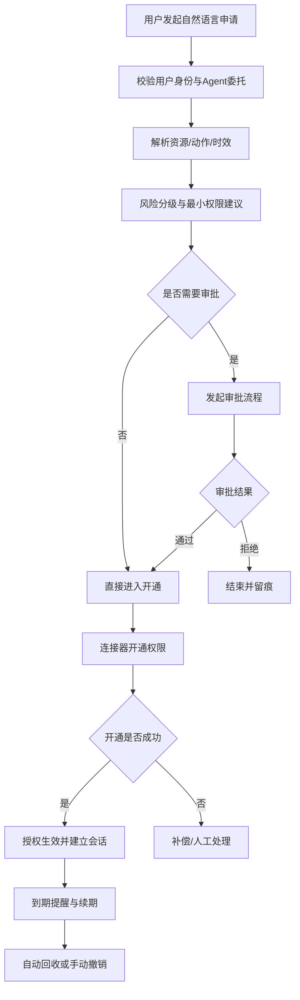
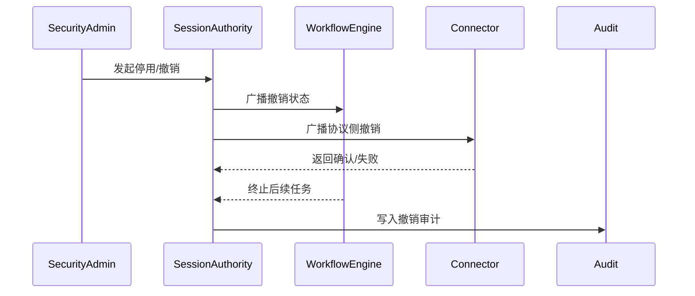

# 软件需求规格说明书（SRS）

## 面向权限自助服务场景的 Agent 身份—委托—动态授权一体化治理系统

> 文档状态：`Frozen`
> 冻结日期：`2026-04-16`
> 冻结说明：本文档已作为 V1 开发基线冻结。自本次冻结起，不再直接修改；后续开发任务拆解、实施记录与阶段验收统一维护在执行类文档中。

## 1. 引言

### 1.1 编写目的

本文档用于定义“面向权限自助服务场景的 Agent 身份—委托—动态授权一体化治理系统”的业务范围、功能需求、数据需求、接口需求、状态机、非功能指标、安全控制与验收标准，为概要设计、详细设计、PoC 开发、测试验证和课题答辩提供统一依据。

本文档面向研发实现，不以纯论文章节写法组织，而以可落地的软件需求规格说明书结构组织。系统设计以“任务状态驱动动态授权”为底座，在此基础上引入 Agent 独立身份、可验证委托、上下文感知访问控制、独立安全推理引擎、统一会话治理与工具执行前治理。平台一期以一个显式的“权限自助服务 Agent”为核心交互主体，工作流、策略、会话和连接器能力以治理服务形式提供；多 Agent 协同作为后续扩展方向保留。

### 1.2 项目背景

传统工作流系统通常围绕“用户—角色—任务—权限”构建，能够支持基础流程执行与角色权限分配，但在多智能体和大模型驱动场景中暴露出以下问题：

- 权限授予与任务状态耦合不充分，导致权限持有时间过长。
- 职责分离多依赖静态规则，难以结合历史路径阻断跨会话绕过。
- Agent 可自主推理、调用工具、跨系统访问资源，传统主体模型难以准确刻画其边界。
- 现有系统难以回答“哪个 Agent 替谁执行、凭什么执行、能执行到什么程度、何时必须回收”。
- 在异步执行、长链路工作流和多协议接入条件下，局部撤销与全局撤销容易出现不一致。

本系统以工作流内部任务状态驱动动态授权模型为核心出发点，结合历史路径校验、上下文风险分析和统一会话治理机制，构建一套面向企业级 Agent 场景的身份与权限治理平台。平台一期围绕一个用户侧权限自助服务 Agent 构建，未来可在该治理底座上扩展多 Agent 协同能力。

### 1.3 设计依据

- 任务状态驱动动态授权：权限不与任务静态绑定，而与任务执行状态绑定，状态结束后权限立即回收。
- 职责分离增强：保留静态职责分离、动态职责分离，并引入历史工作流路径约束。
- 单 Agent 闭环优先：平台一期采用一个用户侧权限自助服务 Agent，搭配工作流、策略、会话、审计和连接器等服务组件；后续再扩展多 Agent 协同。
- Agent 独立身份：Agent 作为可治理数字主体存在，而不是仅作为用户的隐式脚本。
- 委托授权链：用户、Agent、委托范围、审批结果和实际访问行为必须形成可验证链路。
- 执行前治理：高风险动作必须在副作用发生前完成独立安全裁决。

### 1.4 适用范围

本系统适用于以下场景：

- 企业内部权限申请、审批、开通、续期、回收和审计闭环。
- 需要结合任务状态、上下文、历史行为和风险等级进行细粒度授权的业务系统。
- 存在“用户授权 Agent 代办任务”需求，且要求全过程审计和责任追踪的系统。

### 1.5 术语定义

| 术语 | 定义 |
| --- | --- |
| Agent | 具备自主感知、推理、决策和执行能力的智能体执行主体 |
| Delegation | 用户向 Agent 授予特定任务范围、资源范围和时效约束的代办授权 |
| Task State | 任务在生命周期中的离散状态，是动态授权的最小触发单元 |
| Access Authorization | 判断当前主体是否具备访问某资源或工具的资格 |
| Action Authorization | 判断某次具体动作在当前上下文下是否允许执行 |
| SoD | 职责分离约束，包括静态职责分离、动态职责分离、历史路径约束 |
| Connector | 连接外部系统的适配组件，例如飞书、BI、知识库、数据库等 |
| Session Authority | 统一管理全局会话状态、撤销状态和同步状态的逻辑组件 |
| ITAdmin | 负责连接器配置、权限映射、异常补偿和平台运维的 IT/系统管理员 |

### 1.6 主案例体现

本文档以“权限自助服务 Agent”为贯穿案例。典型请求为：“我需要查看销售部 Q3 报表，但不需要修改权限。”系统需完成需求解析、风险评估、审批流发起、权限开通、到期提醒、一键续期、自动回收和审计留痕。

## 2. 系统目标

### 2.1 业务目标

- 将权限申请从人工表单驱动改造为自然语言驱动。
- 将申请、审批、开通、续期、回收串成统一流程，降低跨部门沟通成本。
- 将平均权限开通时间从天级压缩到分钟级。
- 降低因权限配置错误、审批信息不完整或越权开通造成的业务和安全风险。

### 2.2 安全目标

- 实现最小权限原则，授权粒度固定为“资源 + 动作 + 时效”。
- 实现静态职责分离、动态职责分离和历史路径约束。
- 保障 Agent 的每次执行均可追溯到身份、委托、审批和会话上下文。
- 实现任务状态切换后的自动权限回收和跨协议全局撤销。
- 对高风险动作实施执行前治理，避免有访问权限但动作越界的情况。

### 2.3 系统目标

- 提供一个显式的权限自助服务 Agent 与一组治理服务组件。
- 提供 Agent 身份、委托、审批、授权、会话、工具治理和审计一体化能力。
- 支持统一管理用户、角色、任务、任务状态、权限、策略、风险规则和连接器。
- 支持通过连接器与飞书等外部系统对接，实现审批与实际开通联动。

### 2.4 验证目标

- 通过“权限自助服务 Agent”主案例验证系统端到端闭环。
- 通过风险场景验证职责分离、动态授权、全局撤销和审计可追溯性。
- 通过性能指标验证授权评估、审批回调、撤销同步和审计落库满足平台一期要求。

### 2.5 非目标范围

以下内容不属于平台一期必交付范围：

- 原生 DID/VC 生产级实现。
- 跨组织联合身份互信和跨租户联盟治理。
- 所有企业系统的全面接入。
- 完整自动化策略学习和自适应自优化引擎。
- 多 Agent 协同编排和多级再委托。

### 2.6 主案例体现

对主案例而言，系统目标不是单纯替代人工填表，而是建立“员工身份 + Agent 身份 + 委托凭证 + 审批结果 + 最小权限 + 审计链”的完整通行证体系。

## 3. 系统范围与边界

### 3.1 平台一期范围

平台一期包含以下能力：

- 一个 first-party 权限自助服务 Agent 的自然语言申请入口。
- 用户身份校验、Agent 身份管理和委托授权管理。
- 任务状态驱动的动态授权。
- 风险分级和动态审批升级。
- 独立安全推理引擎。
- 飞书审批与飞书文档/报表类只读权限开通连接器。
- 到期提醒、续期、自动回收。
- 全局会话治理与撤销同步。
- 全链路审计与责任追踪。

### 3.2 系统边界

系统内组件包括：

- 用户门户或会话入口。
- 权限自助服务 Agent。
- 工作流引擎。
- 授权决策服务。
- 安全推理引擎。
- 委托与凭证服务。
- 会话治理服务。
- 审批适配器。
- 权限开通连接器。
- 管理员运营后台。
- 审计与监控服务。

系统外部依赖包括：

- 企业 IAM 或 SSO。
- 飞书审批与资源接口。
- 业务资源系统、BI 系统、文档系统等被管资源。
- 日志与告警平台。

### 3.3 信任边界

| 边界对象 | 默认信任级别 | 控制要求 |
| --- | --- | --- |
| 企业 IAM/SSO | 高 | 作为用户身份根信任，失败时禁止发起新授权 |
| 平台内部授权服务 | 高 | 必须启用签名、审计、防篡改和最小权限部署 |
| Agent 执行体 | 中 | 必须通过身份、委托、任务状态和策略共同约束 |
| 外部连接器 | 中 | 必须经过执行前授权和结果校验，不能默认信任其执行成功 |
| 外部资源系统 | 中 | 信任其资源元数据与接口返回，但需保留补偿和对账机制 |
| 工具适配器/MCP/A2A | 低到中 | 必须通过统一会话治理和本地执行拦截进行约束 |

### 3.4 业务边界

平台一期聚焦“权限申请与授权治理”，不负责替代所有业务系统的资源模型；资源对象由连接器接入时登记，最终以标准化资源目录纳入治理。

### 3.5 主案例体现

在主案例中，飞书审批和飞书文档权限接口属于外部系统，平台不能默认认为“调用成功即授权成功”，而要回写授权结果并记录对账状态。

## 4. 业务场景

### 4.1 主场景

员工通过自然语言向权限自助服务 Agent 发起需求：“我需要查看销售部 Q3 报表，但不需要修改权限。”

系统需完成以下业务闭环：

1. 识别用户身份并确认其可委托当前 Agent 代办权限申请。
2. 解析自然语言中的资源、动作、时效和业务理由。
3. 将意图映射为结构化申请和最小权限建议。
4. 依据资源敏感度、动作风险、授权时长和跨部门情况进行风险分级。
5. 自动发起相应审批流程。
6. 审批通过后调用飞书连接器完成权限开通。
7. 回写授权状态、会话状态和审计日志。
8. 到期前提醒用户续期，到期后自动回收权限。

### 4.2 辅助场景

- 用户申请编辑权限，被系统识别为高风险并升级审批。
- IT 管理员在自动开通失败后发起补偿处理或人工校正。
- 用户在权限到期前点击一键续期，系统复用原审批上下文并重新评估风险。
- 安全管理员紧急停用某 Agent，系统将撤销状态广播到所有会话和连接器。

### 4.3 反向场景

- 用户描述含糊不清，系统不得盲目签发权限，而应进入补充信息或人工处理。
- 委托过期或审批回调失败，系统不得继续开通权限。
- 连接器调用成功但资源系统未实际生效，系统必须记录不一致状态并触发补偿。

### 4.4 主案例体现

本文档的所有需求均应能够映射回“申请查看销售报表只读权限”的主案例，并解释该案例在异常、升级审批、续期、回收和审计条件下的行为。

## 5. 角色与主体模型

### 5.1 角色定义

#### 5.1.1 人工角色

| 主体 | 说明 | 核心职责 |
| --- | --- | --- |
| User | 真实员工或业务发起人 | 提交申请、委托 Agent、查看结果、续期 |
| Approver | 直属主管或业务审批人 | 对申请的业务合理性进行审批 |
| ResourceOwner | 资源所有者 | 对敏感资源访问边界和资源归属负责 |
| ITAdmin | IT/系统管理员 | 维护连接器、权限映射、开通补偿和异常处理 |
| SecurityAdmin | 安全管理员 | 管理风险规则、策略例外、紧急撤销和审计要求 |

#### 5.1.2 系统主体

| 主体 | 说明 | 核心职责 |
| --- | --- | --- |
| PermissionAssistantAgent | 平台一期唯一的用户侧 Agent | 解析需求、生成申请、反馈结果、协助续期 |
| WorkflowEngine | 工作流引擎 | 驱动任务状态流转、编排审批与开通流程 |
| PolicyDecisionService | 风险与授权决策组件 | 执行风险评估、安全裁决和输出控制 |
| ApprovalAdapter | 审批适配组件 | 发起审批、接收审批回调、转换审批状态 |
| ProvisioningConnector | 权限开通连接器 | 执行权限开通、续期、撤销和状态回写 |

### 5.2 主体边界

- User 负责表达业务意图，不直接操纵底层权限配置。
- PermissionAssistantAgent 负责代办申请和交互反馈，但不得绕过委托、审批和策略直接开通权限。
- Approver 决定是否批准，不直接承担技术开通动作。
- ITAdmin 负责连接器配置、映射维护和补偿处理，但不决定业务上是否应该授予权限。
- WorkflowEngine 负责推进状态，不直接决定风险策略。
- SecurityAdmin 拥有策略发布和紧急撤销权限，但不应直接成为业务申请人。

### 5.3 凭证模型

| 凭证/记录 | 作用 | 核心字段 |
| --- | --- | --- |
| UserIdentityCredential | 标识真实用户身份 | user_id、org_id、roles、auth_time |
| AgentIdentity | 标识 Agent 的独立身份 | agent_id、owner_org、capabilities、status、trust_level |
| DelegationCredential | 描述用户对权限自助服务 Agent 的委托 | delegation_id、user_id、agent_id、scope、resources、duration |
| ApprovalRecord | 记录审批链和审批结论 | approval_id、steps、result、expire_at |
| AccessToken/Grant | 描述实际开通结果 | grant_id、resource、action、effective_at、expire_at |
| SessionContext | 描述当前会话和撤销状态 | session_id、principal_chain、protocol_sessions、revocation_state |

### 5.4 五元授权模型

本系统最小授权单位为：

`主体 + 凭证 + 资源 + 动作 + 时效`

其中：

- 主体包括 User、PermissionAssistantAgent 及其组合关系。
- 凭证包括身份、委托、审批和会话上下文。
- 资源包括文档、报表、目录、接口、工具或数据集。
- 动作包括查看、编辑、分享、导出、删除、执行等。
- 时效包括一次性、短时、任务周期和定期复审。

### 5.5 主案例体现

在主案例中，用户是销售相关员工，Agent 是权限助手，资源是销售部 Q3 报表，动作是查看，时效默认建议为 7 天，审批记录与委托凭证共同构成开通依据。

## 6. 功能需求

本章所有功能项统一按“前置条件、输入、处理规则、输出、失败结果、审计要求”描述。

### 6.1 工作流任务状态驱动授权模块

#### 6.1.1 前置条件

- 工作流模板已配置。
- 任务、任务状态、角色、权限和状态映射已注册。
- 用户已通过身份认证。

#### 6.1.2 输入

- 任务实例创建请求。
- 当前任务状态。
- 角色激活请求。
- 历史工作流路径信息。

#### 6.1.3 处理规则

- 系统必须支持任务模板、任务实例和任务状态管理。
- 系统必须支持至少以下任务状态：准备、执行、挂起、失败、终止、完成。
- 系统必须支持任务状态与权限映射配置。
- 系统必须在任务状态迁移时自动回收旧状态权限，并在新状态生效前重新计算可授予权限。
- 系统必须支持静态职责分离、动态职责分离和历史路径约束校验。

#### 6.1.4 输出

- 当前任务实例状态。
- 当前可用权限集合。
- 职责分离校验结果。
- 权限授予或回收结果。

#### 6.1.5 失败结果

- 状态非法迁移时，拒绝执行并记录原因。
- 职责分离冲突时，拒绝激活角色或拒绝进入下游任务。
- 权限映射缺失时，默认不授予。

#### 6.1.6 审计要求

- 记录任务实例、旧状态、新状态、触发主体、触发时间、授予权限、回收权限和冲突原因。

#### 6.1.7 主案例体现

主案例中，权限申请任务从“待评估”进入“审批中”后，只能保留查看申请单与补充材料的权限；进入“已批准待开通”后，才允许触发连接器开通动作。

### 6.2 Agent 独立身份管理模块

#### 6.2.1 前置条件

- 管理员或系统初始化流程已启用。

#### 6.2.2 输入

- Agent 注册请求。
- Agent 变更请求。
- Agent 启停或撤销请求。

#### 6.2.3 处理规则

- 系统必须为每个 Agent 生成全局唯一标识。
- 系统必须维护 Agent 名称、类型、版本、能力集合、工具集合、行为范围、所属组织、创建者、控制者、安全级别、信誉等级和生命周期状态。
- 系统必须支持 Agent 的注册、启用、停用、更新和撤销。
- 平台一期至少支持一个 first-party 权限自助服务 Agent，并允许预留多 Agent 扩展字段。
- 系统必须建立 Agent 与任务域、资源域和连接器能力之间的映射。
- 系统必须支持 Agent 独立停用，且停用后触发会话治理层执行全局撤销。

#### 6.2.4 输出

- Agent 身份记录。
- Agent 状态变更结果。
- Agent 能力描述。

#### 6.2.5 失败结果

- 身份重复、能力声明非法、状态切换非法时拒绝注册或变更。
- 已停用 Agent 不得继续发起任何授权请求。

#### 6.2.6 审计要求

- 记录 Agent 生命周期事件、变更人、变更前后值、撤销原因。

#### 6.2.7 主案例体现

权限助手 Agent 必须有独立 `agent_id` 和可审计的能力边界，不能以“普通系统账号”替代其身份表示。

### 6.3 委托授权管理模块

#### 6.3.1 前置条件

- User 已认证。
- Agent 处于启用状态。

#### 6.3.2 输入

- 用户委托请求。
- 委托范围、时效和资源约束。
- 委托约束策略。

#### 6.3.3 处理规则

- 系统必须支持用户向 Agent 发起显式委托。
- 委托必须包含发起人、被委托 Agent、任务目标、资源范围、允许动作、有效期、审批条件和撤销条件。
- 系统必须支持一次性委托、任务周期委托、临时委托和长期委托。
- 系统必须支持委托凭证签发、校验、过期、撤销和刷新。
- 平台一期只要求支持用户到权限自助服务 Agent 的单层委托；若后续扩展到多 Agent，子级委托必须执行范围衰减。

#### 6.3.4 输出

- 委托凭证。
- 委托校验结果。
- 委托撤销结果。

#### 6.3.5 失败结果

- 无法验证用户身份、Agent 状态无效、委托范围超出授权策略时拒绝生成委托。
- 委托过期、被撤销或 scope 不匹配时拒绝后续执行。

#### 6.3.6 审计要求

- 记录委托链、范围变化、撤销时间和撤销原因。

#### 6.3.7 主案例体现

员工向权限助手发起“帮我申请只读权限”时，系统必须先建立“用户授权 Agent 代办申请”的委托，而不能默认 Agent 天生拥有代办权。

### 6.4 意图解析与风险评估模块

#### 6.4.1 前置条件

- 输入文本已通过基础身份校验。
- 资源目录、动作词典和策略库已初始化。

#### 6.4.2 输入

- 自然语言申请文本。
- 用户上下文。
- Agent 上下文。
- 资源目录和动作映射规则。

#### 6.4.3 处理规则

- 系统必须从自然语言中提取资源、动作、时效、业务理由和限制条件。
- 系统必须将业务意图映射为结构化权限申请。
- 系统必须基于资源敏感度、动作危险度、授权时长、跨部门访问和副作用风险进行风险打分。
- 系统必须支持文本含糊时返回待补充信息或转人工。
- 系统必须输出最小权限建议，不能默认放大为系统级角色。

#### 6.4.4 输出

- 结构化权限申请。
- 风险评分和风险等级。
- 最小权限建议。
- 是否进入审批的标志。

#### 6.4.5 失败结果

- 资源无法识别、动作不明确、策略冲突时进入挂起或人工处理。
- 风险评分服务异常时，默认按高风险处理或直接拒绝。

#### 6.4.6 审计要求

- 记录原始文本、解析结果、风险因子、规则命中情况和人工补充记录。

#### 6.4.7 主案例体现

“查看销售部 Q3 报表，但不需要修改”应被解析为“资源=销售部 Q3 报表、动作=查看、禁止动作=修改、建议权限=只读、默认时效=7 天”。

### 6.5 上下文感知访问控制与安全推理模块

#### 6.5.1 前置条件

- 委托凭证有效。
- 当前任务实例已建立。
- 风险规则和策略已发布。

#### 6.5.2 输入

- 访问请求或工具调用请求。
- 上下文快照。
- 委托凭证。
- 任务状态。
- 风险规则和策略版本。

#### 6.5.3 处理规则

- 系统必须综合用户身份、Agent 身份、关系、任务状态、资源敏感度、时间环境、历史行为和风险评分进行决策。
- 系统必须输出以下结果之一：允许、拒绝、脱敏允许、摘要允许、审批后允许、延迟执行、人工复核。
- 系统必须将安全推理与主任务 Agent 逻辑隔离，避免业务模型直接决定安全结果。
- 对高风险动作，系统必须执行 action authorization。

#### 6.5.4 输出

- 授权裁决结果。
- 输出控制策略。
- 解释性理由。

#### 6.5.5 失败结果

- 安全推理引擎不可用时，默认拒绝高风险动作。
- 上下文缺失时，进入挂起或人工复核。

#### 6.5.6 审计要求

- 记录输入上下文、命中策略、裁决结果、解释信息和策略版本。

#### 6.5.7 主案例体现

若用户申请的资源属于高敏销售数据，即便文本意图为“只读”，系统仍需考虑用户所属部门、历史访问行为和时效需求后再决定是否升级审批。

### 6.6 审批与权限开通模块

#### 6.6.1 前置条件

- 已形成结构化申请和风险等级。

#### 6.6.2 输入

- 权限申请单。
- 风险等级。
- 审批链配置。
- 外部连接器配置。

#### 6.6.3 处理规则

- 系统必须支持根据风险等级动态决定审批链。
- 系统必须支持审批通过后调用外部连接器执行实际开通。
- 系统必须支持审批回调、开通结果回写和异常补偿。
- 系统必须区分“审批通过”和“开通成功”两个状态。
- 系统必须支持到期提醒、一键续期和自动回收。

#### 6.6.4 输出

- 审批状态。
- 开通状态。
- 到期时间。
- 续期结果。

#### 6.6.5 失败结果

- 审批拒绝时，终止开通流程。
- 审批通过但开通失败时，进入待补偿或人工处理。
- 回调超时或状态不一致时，记录异常并触发重试。

#### 6.6.6 审计要求

- 记录审批链、审批意见、开通调用参数、开通结果、补偿过程和续期轨迹。

#### 6.6.7 主案例体现

主案例中，审批通过后系统调用飞书接口开通报表只读权限，开通成功后写入到期时间，并在到期前发送提醒。

### 6.7 统一会话治理模块

#### 6.7.1 前置条件

- 已建立用户、Agent 或连接器会话。

#### 6.7.2 输入

- 会话建立请求。
- 会话状态变更事件。
- 撤销或停用指令。

#### 6.7.3 处理规则

- 系统必须生成全局会话标识，并映射 Agent 会话、任务会话、协议会话和工具会话。
- 系统必须支持集中式或逻辑集中式会话治理。
- 系统必须支持停用 Agent、撤销委托、任务终止、策略更新时的全局撤销广播。
- 系统必须支持跨协议一致性控制，保证 MCP、A2A、REST 和连接器侧状态同步。

#### 6.7.4 输出

- 当前会话状态。
- 广播结果。
- 撤销结果。

#### 6.7.5 失败结果

- 同步失败时触发告警和重试。
- 未确认撤销生效前，系统必须阻断高风险后续动作。

#### 6.7.6 审计要求

- 记录会话建立、扩展、降级、停用、撤销和广播确认结果。

#### 6.7.7 主案例体现

若权限助手 Agent 被停用，即便某个飞书连接器仍持有旧 token，系统也必须通过会话治理层阻断其继续执行敏感操作。

### 6.8 工具与连接器治理模块

#### 6.8.1 前置条件

- 工具和连接器已注册。

#### 6.8.2 输入

- 工具注册信息。
- 调用请求。
- 参数边界和风险等级。

#### 6.8.3 处理规则

- 系统必须为每个工具定义风险等级、允许动作、参数边界和副作用说明。
- 系统必须在工具调用前校验当前任务状态、委托范围、审批结果和策略要求。
- 系统必须支持执行前拦截、结果脱敏、调用失败补偿和熔断。
- 系统必须支持对 side-effecting 工具执行 action authorization。

#### 6.8.4 输出

- 调用允许或拒绝结果。
- 输出控制结果。
- 连接器执行结果。

#### 6.8.5 失败结果

- 参数越界、状态不匹配、会话已撤销时拒绝调用。
- 工具异常时返回明确错误并触发补偿或熔断。

#### 6.8.6 审计要求

- 记录工具调用参数摘要、风险等级、执行结果、回滚结果和输出脱敏情况。

#### 6.8.7 主案例体现

飞书权限开通连接器必须被视为高风险工具，调用前必须确认审批状态、委托状态、任务状态和资源动作范围都匹配。

### 6.9 审计、监控与运维模块

#### 6.9.1 前置条件

- 系统已部署日志和告警基础能力。

#### 6.9.2 输入

- 授权事件。
- 审批事件。
- 会话事件。
- 连接器事件。
- 异常事件。

#### 6.9.3 处理规则

- 系统必须记录用户、Agent、委托、任务、状态、审批、资源访问、工具调用、会话变化和裁决结果。
- 系统必须支持按用户、Agent、资源、审批单、委托链、会话链和责任链查询。
- 系统必须支持关键告警，包括审批回调失败、连接器失败、撤销不同步、策略冲突和异常高频申请。
- 系统必须支持日志防篡改和长期留存。

#### 6.9.4 输出

- 审计日志。
- 监控指标。
- 告警事件。

#### 6.9.5 失败结果

- 日志写入失败时必须进入本地持久化缓冲并告警。
- 告警平台不可用时，系统不得丢弃高优先级安全事件。

#### 6.9.6 审计要求

- 本模块本身也必须记录配置变更和告警处理轨迹。

#### 6.9.7 主案例体现

主案例中，从自然语言申请到最终回收的每个步骤都应可回放，能够回答“谁在什么时候通过哪个 Agent 申请了什么权限、为何被批准、谁开通、何时回收”。

## 7. 风险分级与审批升级规则

### 7.1 风险输入项

风险分级至少基于以下五类输入：

| 维度 | 说明 |
| --- | --- |
| 资源敏感度 | 资源所属部门、保密等级、数据影响范围 |
| 动作危险度 | 查看、编辑、删除、分享、导出、批量操作等 |
| 授权时长 | 一次性、短时、7 天、30 天、长期 |
| 组织边界 | 是否跨部门、跨系统、跨租户 |
| 副作用风险 | 是否产生写入、删除、通知、对外发送等副作用 |

### 7.2 风险等级定义

| 风险等级 | 判定规则示例 | 默认审批链 |
| --- | --- | --- |
| 低风险 | 低敏资源、只读、短时、不跨部门 | 自动批准或直属主管 |
| 中风险 | 中敏资源、只读但跨部门，或低敏编辑 | 直属主管 + 资源 Owner |
| 高风险 | 高敏资源、写权限、批量导出、长期授权、有副作用 | 直属主管 + 资源 Owner + 安全管理员 |

### 7.3 审批升级规则

- 任一输入维度达到高风险阈值，整体提升为高风险。
- 低风险请求在历史异常频发时可升级为中风险。
- 续期请求默认继承原风险等级，但若资源敏感度、组织边界或时效发生变化，必须重新评估。
- 人工复核结论可覆盖自动分级结果，但必须记录原因。

### 7.4 主案例体现

“查看销售部 Q3 报表只读 7 天”在同部门情况下可被评估为低到中风险；若申请人来自其他部门或请求导出，则必须升级审批。

## 8. 数据需求

### 8.1 核心数据对象

| 数据对象 | 说明 |
| --- | --- |
| User | 用户基础信息与组织信息 |
| AgentIdentity | Agent 独立身份与能力边界 |
| DelegationCredential | 用户到 Agent 的委托关系 |
| Role | 角色定义与角色层次 |
| Task | 任务定义 |
| TaskState | 任务状态定义 |
| Permission | 资源与动作组合形成的权限项 |
| TaskStatePermissionMap | 任务状态到权限的映射 |
| WorkflowTemplate | 工作流模板 |
| WorkflowInstance | 工作流实例 |
| ContextSnapshot | 请求发生时的上下文快照 |
| PolicyRule | 授权规则 |
| RiskRule | 风险分级规则 |
| AuthorizationDecision | 单次裁决结果 |
| SessionContext | 全局会话和协议会话状态 |
| ApprovalRecord | 审批轨迹 |
| AccessGrant | 实际开通的权限记录 |
| AuditRecord | 审计记录 |

### 8.2 继承论文的数据表

系统在论文已有 14 张表基础上扩展，至少包含以下表或等价对象：

- 用户信息表
- 角色信息表
- 用户角色关系表
- 任务信息表
- 任务执行状态表
- 角色任务关系表
- 工作流历史信息表
- 权限信息表
- 任务权限关系表
- 任务执行状态与权限关系表
- 任务与任务执行状态关系表
- 管理员信息表
- 工作流模板表
- 工作流执行状态信息表

### 8.3 新增数据表

- Agent 身份表
- Agent 能力表
- Delegation 委托凭证表
- 上下文快照表
- 策略规则表
- 风险规则表
- 审批记录表
- 授权裁决表
- 全局会话表
- 协议会话映射表
- Access Grant 表
- 告警事件表
- 连接器注册表

### 8.4 最小字段要求

#### 8.4.1 AgentIdentity

- agent_id
- agent_name
- agent_type
- owner_org
- creator_id
- controller_id
- capability_set
- tool_set
- behavior_scope
- trust_level
- security_level
- lifecycle_status
- model_version
- created_at
- updated_at

#### 8.4.2 DelegationCredential

- delegation_id
- delegator_user_id
- delegate_agent_id
- target_task
- resource_scope
- allowed_actions
- effective_at
- expire_at
- allow_redelegation
- approval_required
- revocation_status
- signature

#### 8.4.3 AuthorizationDecision

- decision_id
- request_id
- subject_chain
- task_id
- task_state
- resource_id
- action
- risk_level
- decision_result
- policy_version
- explanation
- created_at

#### 8.4.4 SessionContext

- global_session_id
- principal_chain
- task_session_id
- protocol_session_refs
- current_revocation_state
- last_sync_at
- expire_at

### 8.5 数据治理要求

- 关键主键必须全局唯一。
- 审批记录、授权记录、审计日志和撤销日志必须可追溯且不可静默覆盖。
- 关键日志数据必须支持签名、哈希链或等价防篡改能力。

### 8.6 主案例体现

主案例至少会落地 `PermissionRequest`、`DelegationCredential`、`ApprovalRecord`、`AccessGrant`、`SessionContext` 和 `AuditRecord` 六类核心记录。

## 9. 接口需求

本章描述逻辑接口，具体协议可采用 REST、gRPC 或事件总线，但字段语义必须保持一致。

### 9.1 外部接口

| 接口对象 | 方向 | 说明 |
| --- | --- | --- |
| 企业 IAM/SSO | 入站 | 校验用户身份、同步组织和角色基础信息 |
| 飞书审批接口 | 双向 | 发起审批、接收审批结果回调 |
| 飞书权限接口 | 出站 | 开通、续期、撤销文档或资源权限 |
| 审计/告警平台 | 出站 | 上报日志、指标和告警 |
| 资源目录服务 | 双向 | 查询资源元数据、Owner、敏感级别 |

### 9.2 内部接口清单

| 接口 | 调用方 | 作用 |
| --- | --- | --- |
| `POST /permission-requests` | 用户入口/Agent | 提交自然语言或结构化权限申请 |
| `POST /permission-requests/{id}/evaluate` | 工作流引擎 | 执行意图解析和风险评估 |
| `POST /approvals/callback` | 审批系统 | 回写审批结果 |
| `POST /grants/{id}/provision` | 工作流引擎 | 执行权限开通 |
| `POST /grants/{id}/renew` | 用户入口/Agent | 发起续期 |
| `POST /grants/{id}/revoke` | 系统/管理员 | 执行撤销 |
| `POST /sessions/revoke` | 安全管理员/系统 | 触发全局会话撤销 |
| `GET /audit-records` | 管理员/审计员 | 查询审计日志 |
| `POST /delegations` | 用户入口/Agent | 创建委托凭证 |
| `POST /connectors/{id}/execute` | 授权服务 | 调用工具或连接器 |

### 9.3 关键接口语义要求

#### 9.3.1 申请提交接口

- 输入必须支持自然语言描述和结构化字段。
- 输出必须返回 request_id、初始状态、是否需要补充信息。

#### 9.3.2 评估接口

- 输入必须包含请求 ID、主体链和上下文快照。
- 输出必须包含结构化资源、动作、时效、风险等级、建议审批链和建议最小权限。

#### 9.3.3 审批回调接口

- 必须验证回调签名、审批单状态和幂等标识。
- 必须将“审批通过”和“审批撤回”视为不同事件处理。

#### 9.3.4 开通接口

- 必须在开通前再次校验委托、审批、任务状态和会话有效性。
- 必须区分“已提交连接器”和“资源系统已生效”。

#### 9.3.5 撤销接口

- 必须支持按 grant、按 agent、按 delegation、按 session 触发撤销。
- 撤销必须返回同步范围和确认结果。

### 9.4 错误处理要求

- 错误码至少区分身份错误、委托错误、审批错误、策略错误、连接器错误、会话错误和系统内部错误。
- 对高风险操作，任何不可判定错误都应按拒绝处理。

### 9.5 主案例体现

主案例将依次调用申请提交、评估、审批回调、开通、续期和撤销接口，形成完整闭环。

## 10. 状态机与流程

### 10.1 权限申请状态机

| 状态 | 说明 | 触发事件 |
| --- | --- | --- |
| Draft | 草稿或待补充信息 | 用户提交草稿、信息不足 |
| Submitted | 已提交待评估 | 用户正式提交 |
| Evaluating | 正在解析和风控评估 | 工作流引擎启动评估 |
| PendingApproval | 待审批 | 风险评估完成且需审批 |
| Approved | 已批准待开通 | 审批通过 |
| Rejected | 已拒绝 | 审批拒绝或策略拒绝 |
| Provisioning | 开通中 | 连接器开始执行 |
| Active | 已生效 | 权限开通成功 |
| Expiring | 即将到期 | 到期提醒触发 |
| Expired | 已到期 | 自动过期 |
| Revoked | 已撤销 | 手动或系统撤销 |
| Failed | 执行失败 | 开通失败或同步失败 |

### 10.2 审批状态机

| 状态 | 说明 |
| --- | --- |
| NotRequired | 无需审批 |
| Pending | 审批中 |
| PartiallyApproved | 部分审批通过 |
| Approved | 审批通过 |
| Rejected | 审批拒绝 |
| Withdrawn | 审批撤回 |
| Timeout | 审批超时 |

### 10.3 授权状态机

| 状态 | 说明 |
| --- | --- |
| NotGranted | 未授予 |
| Granted | 已授予 |
| Suspended | 暂停生效 |
| Renewing | 续期中 |
| Expired | 已过期 |
| Revoked | 已撤销 |

### 10.4 任务状态机

| 状态 | 说明 |
| --- | --- |
| Ready | 准备态 |
| Running | 执行态 |
| Suspended | 挂起态 |
| Failed | 失败态 |
| Terminated | 终止态 |
| Completed | 完成态 |

### 10.5 会话状态机

| 状态 | 说明 |
| --- | --- |
| Created | 已创建 |
| Active | 活跃中 |
| Degraded | 已降级 |
| Revoking | 撤销传播中 |
| Revoked | 已撤销 |
| Expired | 已过期 |
| SyncFailed | 同步失败待补偿 |

### 10.6 关键流程

#### 10.6.1 主流程

#### 10.6.2 全局撤销流程

### 10.7 回滚条件

- 审批通过但开通失败时，申请状态回到 Failed，并产生补偿任务。
- 会话撤销未完全同步时，系统将高风险动作默认阻断。
- 续期失败时，原授权不得被无条件延长。

### 10.8 主案例体现

主案例必须能够完整跑通主流程，并在人工撤销或 Agent 停用时触发全局撤销流程。

## 11. 非功能需求

### 11.1 安全性

- 必须遵循默认不信任和失败默认安全原则。
- 高风险动作必须在副作用发生前完成独立裁决。
- 关键日志必须具备防篡改能力。
- 权限、委托和会话撤销必须支持全局一致性控制。

### 11.2 性能

平台一期性能指标如下：

| 指标 | 目标 |
| --- | --- |
| 普通授权评估时延 | P95 不超过 2 秒 |
| 高风险授权评估时延 | P95 不超过 5 秒 |
| 审批回调状态写入 | 30 秒内生效 |
| 会话撤销广播时间 | 60 秒内完成主要节点同步 |
| 审计日志落库 | 5 秒内完成 |

### 11.3 并发与容量

- 支持至少 100 个并发 Agent 会话。
- 支持至少 1000 个日均权限申请单。
- 支持不少于 50 个已注册工具或连接器。

### 11.4 可扩展性

- 支持新增连接器、协议适配器、资源类型和风险规则而不影响核心流程。
- 支持从飞书场景扩展至 BI、数据库、知识库和代码仓库。

### 11.5 可解释性

- 每次关键裁决必须输出可理解的裁决理由。
- 风险升级和审批升级必须能说明命中规则。

### 11.6 可维护性

- 策略必须支持版本化和灰度发布。
- Agent、连接器、策略、资源目录必须支持独立配置和升级。

### 11.7 可用性

- 授权服务和会话治理服务应具备高可用部署能力。
- 非关键组件故障不得导致无策略放行。

### 11.8 主案例体现

主案例中的普通只读权限申请应满足低延迟体验；高风险审批和撤销传播可以允许更高延迟，但必须保证安全优先。

## 12. 安全与风控要求

### 12.1 职责分离要求

- 系统必须支持静态职责分离。
- 系统必须支持动态职责分离。
- 系统必须结合历史路径校验跨会话、跨任务的互斥角色绕过风险。

### 12.2 异常与失败策略

| 异常场景 | 默认策略 |
| --- | --- |
| 身份服务不可用 | 禁止新申请进入授权流程 |
| 风险评估不可用 | 高风险默认拒绝，低风险进入挂起 |
| 审批回调异常 | 进入待确认状态，不开通权限 |
| 连接器执行失败 | 进入补偿或人工处理，不标记为生效 |
| 会话同步失败 | 持续重试并阻断高风险后续动作 |
| 日志写入失败 | 本地缓冲并告警 |

### 12.3 主要风险与控制

| 风险 | 控制要求 |
| --- | --- |
| 身份混淆 | 强制记录用户身份、Agent 身份和委托链 |
| 委托越界 | 对委托范围执行精确校验；多级再委托扩展时必须强制范围衰减 |
| 状态越权 | 任务状态切换时立即回收旧权限 |
| 提示注入 | 将安全推理与业务模型隔离 |
| 过期审批重放 | 审批回调必须校验幂等和时效 |
| 跨协议残留会话 | 统一会话治理和广播确认机制 |
| 高风险工具副作用 | 执行前授权和结果回滚机制 |

### 12.4 策略治理要求

- 策略必须支持版本管理。
- 策略发布必须支持灰度范围控制。
- 策略必须支持紧急禁用和版本回滚。
- 策略执行必须能够回溯到具体版本和发布时间。

### 12.5 运维要求

- 关键日志留存周期不少于 180 天。
- 高优先级安全告警必须支持值班通知。
- 撤销传播状态必须具备可视化监控。

### 12.6 主案例体现

若主案例审批通过后，飞书开通接口失败，系统必须显示“已批准未生效”，而不能错误展示为“已开通”。

## 13. 验收标准与测试需求

### 13.1 功能验收

- 能完成自然语言申请、解析、风险评估、审批、开通、续期、回收闭环。
- 能为每个 Agent 建立独立身份并支持停用、撤销。
- 能生成并校验用户到 Agent 的委托凭证。
- 能在任务状态变化时自动授予和回收权限。
- 能记录完整审批链、会话链、委托链和责任链。

### 13.2 安全验收

- 能拦截静态职责分离冲突。
- 能拦截动态职责分离冲突。
- 能基于历史路径拦截跨会话绕过。
- 能在无委托、委托过期、审批过期时拒绝执行。
- 能在 Agent 停用后实现全局撤销。

### 13.3 对抗性测试

- prompt injection 测试。
- 伪造委托凭证测试。
- 过期审批重放测试。
- 委托越界测试。
- 参数越界测试。
- 跨状态残留权限测试。
- 跨协议残留会话测试。

### 13.4 性能验收

- 普通授权评估达到既定时延指标。
- 高风险授权评估达到既定时延指标。
- 会话撤销广播达到既定时间目标。
- 审计落库达到既定时间目标。

### 13.5 业务验收

以“销售部 Q3 报表只读权限申请”主案例作为必测用例，至少覆盖以下分支：

- 同部门低风险只读申请。
- 跨部门高敏资源访问申请。
- 审批通过后开通失败。
- 到期自动回收。
- 到期前一键续期。
- 安全管理员紧急撤销。

### 13.6 主案例体现

主案例验收通过，意味着系统不但能“跑通流程”，还能证明“最小权限 + 动态授权 + 委托可追溯 + 全局撤销”四项核心能力成立。

## 14. 实施范围与阶段建议

### 14.1 平台一期交付

- 权限自助服务 Agent。
- 用户身份、Agent 身份、委托凭证、审批记录、授权记录、会话记录的基础模型。
- 风险分级、审批升级、权限开通、续期、回收、审计闭环。
- 飞书审批和飞书文档读权限连接器。

### 14.2 二期建议

- 扩展多资源系统连接器。
- 引入更细粒度的策略引擎实现。
- 增强对异步长任务和多 Agent 协同委托的支持。

### 14.3 三期建议

- 引入 DID/VC 或等价可验证身份。
- 支持跨组织联合治理。
- 引入更强的神经—符号混合安全推理。

### 14.4 主案例体现

平台一期即可完整支撑权限自助服务场景；后续阶段主要增强跨系统复用和身份技术前瞻性。

## 15. 需求追踪矩阵

| 需求类别 | 论文底座能力 | 平台升级能力 | 主案例验收点 |
| --- | --- | --- | --- |
| 动态授权 | 任务状态驱动权限切换 | 接入资源、动作、时效三元控制 | 只读权限按状态授予和回收 |
| 职责分离 | 静态/动态/历史约束 | 融合委托链和会话链验证 | 互斥角色无法绕过 |
| 单 Agent 闭环 | 任务状态驱动权限切换 | 以一个权限助手 Agent 串联申请、审批、开通和回收 | 权限助手可独立审计 |
| 身份治理 | 用户与角色 | User + Agent 双身份模型 | 能回答 Agent 替谁执行 |
| 委托治理 | 无明确委托凭证体系 | Delegation 凭证与单层委托校验 | 无委托不得代办 |
| 上下文治理 | 任务与历史上下文 | 加入风险、场景、关系、环境 | 跨部门访问自动升级审批 |
| 会话治理 | 工作流会话 | 全局会话、协议会话和撤销同步 | Agent 停用后连接器失效 |
| 工具治理 | 资源访问控制 | 执行前授权和结果脱敏 | 开通接口调用前二次校验 |
| 审计追踪 | 工作流历史信息 | 委托链、会话链、责任链还原 | 可完整回放一次申请生命周期 |

## 16. 附录：主案例最小闭环说明

### 16.1 用例名称

销售部 Q3 报表只读权限申请

### 16.2 参与方

- 用户
- 权限自助服务 Agent
- 工作流引擎
- 安全推理引擎
- 审批系统
- 飞书权限连接器
- 审计系统

### 16.3 成功判定

- 用户身份校验通过。
- Agent 委托有效。
- 申请被正确解析为只读权限。
- 风险分级正确。
- 审批链符合规则。
- 权限开通成功并回写。
- 到期前完成提醒，到期后完成回收。
- 审计可完整追踪。

### 16.4 失败判定

- 任一环节身份、委托、审批、状态、会话或连接器校验失败，系统不得错误标记为已生效。
