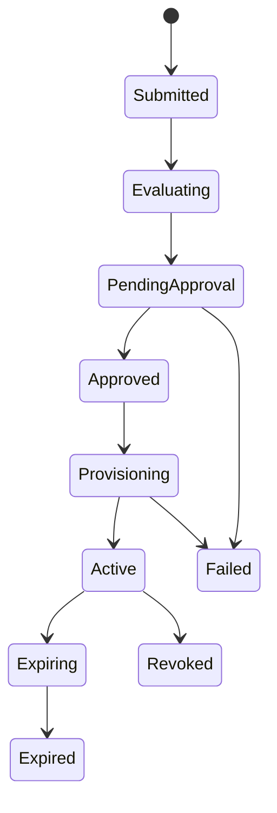
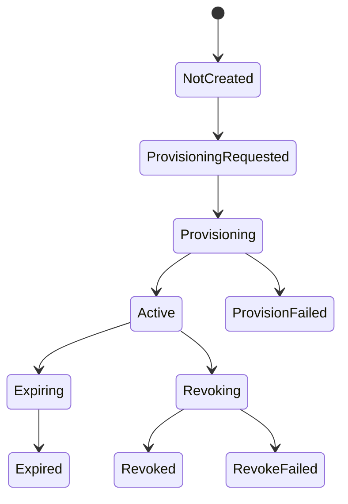

# 状态机文档

## 给 AI 发通行证：Agent 身份与权限系统 V1

| 项目 | 内容 |
| --- | --- |
| 文档名称 | Agent 身份与权限系统状态机文档 |
| 文档标识 | `docs/agent-identity-permission-state-machine.md` |
| 当前版本 | V1.0 |
| 文档状态 | Active |
| 生效日期 | 2026-04-16 |
| 对应基线 | `docs/agent-identity-permission-srs.md` / `docs/agent-identity-permission-technical-design.md` / `docs/agent-identity-permission-development-guide.md` |
| 适用范围 | V1 申请状态、审批状态、授权状态、会话状态、任务状态、事件流与补偿规则 |

## 1. 文档目标

本文档定义 V1 阶段的核心状态机、允许迁移、非法迁移、触发方、前置条件、事件流与补偿规则，作为后端实现、测试断言、审计追踪和异常补偿的统一依据。

## 2. 设计原则

1. 所有状态必须采用枚举值，禁止自由文本。
2. 状态迁移只能由应用层服务或编排层触发，禁止控制器直接改状态。
3. 外部回调不能直接改最终业务状态，必须先校验、落库，再驱动状态迁移。
4. 每次关键迁移都必须写事件。
5. 安全关键迁移必须写审计。
6. 状态不可判定时按更安全路径处理，不做乐观放行。

## 3. 状态机总览

V1 至少包含以下状态机：

- `permission_request`
- `approval`
- `access_grant`
- `session_context`
- `connector_task`
- `notification_task`

## 4. permission_request 状态机

### 4.1 状态定义

| 状态 | 含义 |
| --- | --- |
| `Draft` | 预留草稿态，V1 可不对外暴露 |
| `Submitted` | 已提交原始申请文本 |
| `Evaluating` | 正在解析与评估 |
| `PendingApproval` | 已完成评估，待审批 |
| `Approved` | 审批通过，待进入开通 |
| `Provisioning` | 已进入开通流程 |
| `Active` | 授权已生效 |
| `Expiring` | 即将到期 |
| `Expired` | 已到期 |
| `Revoked` | 已撤销 |
| `Failed` | 当前阶段失败，需重试或补偿 |

### 4.2 主流程图

### 4.3 允许迁移表

| 当前状态 | 触发事件 | 目标状态 | 触发方 | 前置条件 | 迁移后动作 | 审计 |
| --- | --- | --- | --- | --- | --- | --- |
| `Draft` | `request.submitted` | `Submitted` | User / Agent | 委托有效 | 写主表、写事件 | 是 |
| `Submitted` | `request.evaluation_started` | `Evaluating` | System | 申请存在且可评估 | 锁定申请，开始评估 | 否 |
| `Evaluating` | `request.evaluated` | `PendingApproval` | System | 解析成功，风险和审批链已生成 | 落结构化结果，创建审批任务 | 是 |
| `Evaluating` | `request.evaluation_failed` | `Failed` | System | 评估失败 | 写失败原因 | 是 |
| `PendingApproval` | `approval.approved` | `Approved` | System | 审批通过 | 写审批状态，创建 grant | 是 |
| `PendingApproval` | `approval.rejected` | `Failed` | System | 审批被驳回 | 写驳回原因 | 是 |
| `Approved` | `grant.provisioning_requested` | `Provisioning` | System | 审批通过且策略复核通过 | 创建 connector task | 是 |
| `Provisioning` | `grant.provisioned` | `Active` | System | 连接器确认已生效 | 写生效时间，创建 session | 是 |
| `Provisioning` | `grant.provision_failed` | `Failed` | System | 开通失败 | 写失败原因，等待补偿 | 是 |
| `Active` | `grant.expiring` | `Expiring` | System | 到期前阈值触发 | 生成提醒任务 | 否 |
| `Expiring` | `grant.expired` | `Expired` | System | 到期且已回收或失效 | 写到期时间 | 是 |
| `Active` | `grant.revoked` | `Revoked` | System | 撤销完成 | 写撤销时间 | 是 |
| `Failed` | `request.retry_accepted` | `Evaluating` / `Provisioning` | ITAdmin / System | 失败类型允许重试 | 创建重试任务 | 是 |

### 4.4 特别规则

- `Approved` 表示审批通过，不表示权限已生效。
- `Active` 必须依赖 `access_grant.grant_status=Active`。
- `Failed` 不是最终放弃态，允许在补偿后重新进入评估或开通子流程。

## 5. approval 状态机

### 5.1 状态定义

| 状态 | 含义 |
| --- | --- |
| `NotRequired` | 不需要审批 |
| `Pending` | 审批中 |
| `Approved` | 审批通过 |
| `Rejected` | 审批驳回 |
| `Withdrawn` | 审批撤回 |
| `Expired` | 审批超时 |
| `CallbackFailed` | 回调接收失败或映射失败 |

### 5.2 允许迁移表

| 当前状态 | 触发事件 | 目标状态 | 触发方 | 前置条件 | 后续动作 |
| --- | --- | --- | --- | --- | --- |
| `NotRequired` | `approval.skipped` | `Approved` | System | 风险策略允许 | 推进开通 |
| `Pending` | `approval.approved` | `Approved` | Feishu Callback / System | 回调验签通过 | 申请进入 `Approved` |
| `Pending` | `approval.rejected` | `Rejected` | Feishu Callback / System | 回调验签通过 | 申请进入 `Failed` |
| `Pending` | `approval.withdrawn` | `Withdrawn` | Feishu Callback / System | 审批撤回 | 申请进入 `Failed` |
| `Pending` | `approval.expired` | `Expired` | System | 审批超时 | 申请进入 `Failed` |
| `Pending` | `approval.callback_failed` | `CallbackFailed` | System | 回调落库或映射失败 | 触发重试 / 告警 |
| `CallbackFailed` | `approval.callback_reprocessed` | `Pending` / `Approved` / `Rejected` | System / ITAdmin | 原始载荷仍可处理 | 重新消费回调 |

### 5.3 特别规则

- `approval_status=Approved` 不等于 `grant_status=Active`。
- 重复审批回调不得重复推进状态机。
- 审批被驳回后，V1 不直接重开原审批，而是建议发起新的续申请或修正申请。

## 6. access_grant 状态机

### 6.1 状态定义

| 状态 | 含义 |
| --- | --- |
| `NotCreated` | 尚未创建授权记录 |
| `ProvisioningRequested` | 已申请开通 |
| `Provisioning` | 正在开通 |
| `Active` | 已生效 |
| `Expiring` | 即将到期 |
| `Expired` | 已到期 |
| `Revoking` | 正在撤销 |
| `Revoked` | 已撤销 |
| `ProvisionFailed` | 开通失败 |
| `RevokeFailed` | 撤销失败 |

### 6.2 主流程图

### 6.3 允许迁移表

| 当前状态 | 触发事件 | 目标状态 | 触发方 | 前置条件 | 后续动作 | 是否可重试 |
| --- | --- | --- | --- | --- | --- | --- |
| `NotCreated` | `grant.provisioning_requested` | `ProvisioningRequested` | System | 审批通过 | 创建连接器任务 | 否 |
| `ProvisioningRequested` | `grant.provisioning_started` | `Provisioning` | Worker | 任务已领取 | 调用连接器 | 否 |
| `Provisioning` | `grant.accepted` | `Provisioning` | Worker | 连接器仅返回受理成功 | 等待生效确认 | 是 |
| `Provisioning` | `grant.provisioned` | `Active` | Worker / System | 连接器确认生效 | 写 `effective_at` | 否 |
| `Provisioning` | `grant.provision_failed` | `ProvisionFailed` | Worker | 不可忽略失败 | 写失败原因 | 是 |
| `Active` | `grant.expiring` | `Expiring` | System | 到期前阈值触发 | 创建提醒 | 否 |
| `Expiring` | `grant.expired` | `Expired` | System | 已到期 | 触发回收完成 | 否 |
| `Active` | `grant.revoke_requested` | `Revoking` | User / ITAdmin / System | 发起撤销 | 创建撤销任务 | 否 |
| `Revoking` | `grant.revoked` | `Revoked` | Worker | 外部撤销成功 | 更新 session | 否 |
| `Revoking` | `grant.revoke_failed` | `RevokeFailed` | Worker | 外部撤销失败 | 等待补偿 | 是 |
| `ProvisionFailed` | `grant.retry_requested` | `ProvisioningRequested` | ITAdmin / System | 可重试失败 | 新建任务 | 是 |
| `RevokeFailed` | `grant.retry_requested` | `Revoking` | ITAdmin / System | 可重试失败 | 新建任务 | 是 |

### 6.4 特别规则

- “已批准未生效”通过 `request_status=Provisioning` + `grant_status=Provisioning/ProvisioningRequested` 表达。
- 连接器“受理成功”只能推动到 `Provisioning`，不能直接改为 `Active`。
- 续期默认复用现有 `grant_id` 并增加 `renew_round`，如后续接入更复杂资源模型再评估是否拆新记录。

## 7. session_context 状态机

### 7.1 状态定义

| 状态 | 含义 |
| --- | --- |
| `Active` | 会话有效 |
| `Revoking` | 正在撤销 |
| `Revoked` | 已撤销 |
| `Syncing` | 正在同步外部会话状态 |
| `SyncFailed` | 同步失败 |
| `Expired` | 已自然失效 |

### 7.2 允许迁移表

| 当前状态 | 触发事件 | 目标状态 | 触发方 | 前置条件 | 后续动作 |
| --- | --- | --- | --- | --- | --- |
| `Active` | `session.revoke_requested` | `Revoking` | System / SecurityAdmin | Agent 停用、授权到期或人工撤销 | 广播撤销 |
| `Revoking` | `session.revoked` | `Revoked` | System | 外部同步完成 | 关闭执行入口 |
| `Revoking` | `session.sync_failed` | `SyncFailed` | System | 部分会话同步失败 | 进入重试队列 |
| `SyncFailed` | `session.retry_started` | `Syncing` | Worker | 重试中 | 再次同步 |
| `Syncing` | `session.revoked` | `Revoked` | Worker | 重试成功 | 完成撤销 |
| `Active` | `session.expired` | `Expired` | System | 授权自然过期 | 标记失效 |

### 7.3 特别规则

- 高风险动作执行前必须检查 `session_status`，若不为 `Active` 则拒绝执行。
- Agent 停用会触发其关联 `Active` 会话全部进入 `Revoking`。

## 8. connector_task 状态机

### 8.1 状态定义

- `Pending`
- `Running`
- `Succeeded`
- `Failed`
- `Retrying`
- `Compensating`
- `Compensated`

### 8.2 允许迁移

| 当前状态 | 触发事件 | 目标状态 | 说明 |
| --- | --- | --- | --- |
| `Pending` | `task.picked` | `Running` | Worker 领取任务 |
| `Running` | `task.succeeded` | `Succeeded` | 任务成功 |
| `Running` | `task.failed` | `Failed` | 任务失败 |
| `Failed` | `task.retry_requested` | `Retrying` | 准备重试 |
| `Retrying` | `task.picked` | `Running` | 再次执行 |
| `Failed` | `task.compensation_requested` | `Compensating` | 人工补偿 |
| `Compensating` | `task.compensated` | `Compensated` | 补偿完成 |

## 9. notification_task 状态机

### 9.1 状态定义

- `Pending`
- `Running`
- `Succeeded`
- `Failed`
- `Cancelled`

### 9.2 使用场景

- 到期提醒
- 高风险告警
- 撤销失败告警
- 审计补写失败告警

## 10. 事件流映射

| 事件 | 影响状态机 | 关键动作 |
| --- | --- | --- |
| `request.submitted` | `permission_request` | 创建申请主记录 |
| `request.evaluation_started` | `permission_request` | 进入评估 |
| `request.evaluated` | `permission_request` | 回写结构化结果和风险 |
| `approval.required` | `approval` | 发起审批 |
| `approval.approved` | `approval` + `permission_request` | 审批通过，允许进入开通 |
| `approval.rejected` | `approval` + `permission_request` | 审批驳回，申请失败 |
| `grant.provisioning_requested` | `access_grant` + `permission_request` | 创建授权任务 |
| `grant.provisioned` | `access_grant` + `permission_request` + `session_context` | 授权生效，创建会话 |
| `grant.provision_failed` | `access_grant` + `permission_request` | 记录失败，等待补偿 |
| `grant.expiring` | `access_grant` + `permission_request` | 到期提醒 |
| `grant.expired` | `access_grant` + `permission_request` + `session_context` | 自然过期 |
| `grant.revoked` | `access_grant` + `permission_request` + `session_context` | 撤销完成 |
| `session.sync_failed` | `session_context` | 进入补偿 |

## 11. 非法迁移规则

以下迁移一律禁止：

- `Rejected -> Active`
- `Failed -> Active`，若未经过补偿和重新开通
- `Revoked -> Approved`
- `Expired -> Provisioning`
- `Revoked session` 再执行高风险动作
- `ProvisionFailed -> Active`，若没有新的成功开通事件

## 12. 补偿与回滚规则

### 12.1 审批回调失败

- 落 `approval_status=CallbackFailed`
- 原始回调必须保留
- 进入重试或人工重放

### 12.2 开通失败

- `grant_status=ProvisionFailed`
- `request_status=Failed`
- 创建 `connector_task` 重试入口

### 12.3 撤销同步失败

- `session_status=SyncFailed`
- `grant_status=RevokeFailed`
- 触发告警与补偿

### 12.4 审计写入失败

- 不阻塞主交易提交
- 必须创建补写任务或告警事件

### 12.5 重复事件到达

- 如果幂等键已存在，则只记录“重复收到”，不得再次推进状态。

## 13. 主案例状态流

主案例：“我需要查看销售部 Q3 报表，但不需要修改权限”

正常路径：

`Submitted -> Evaluating -> PendingApproval -> Approved -> Provisioning -> Active -> Expiring -> Expired`

若审批被驳回：

`PendingApproval -> Failed`

若开通失败：

`Approved -> Provisioning -> Failed`

grant 侧对应：

`NotCreated -> ProvisioningRequested -> Provisioning -> ProvisionFailed`

## 14. 最低完成标准

状态机文档进入可实施状态，至少需满足：

1. 申请状态机、审批状态机、授权状态机、会话状态机已定义。
2. 非法迁移规则已冻结。
3. 事件流与状态映射清晰。
4. 失败补偿和重试规则明确。
