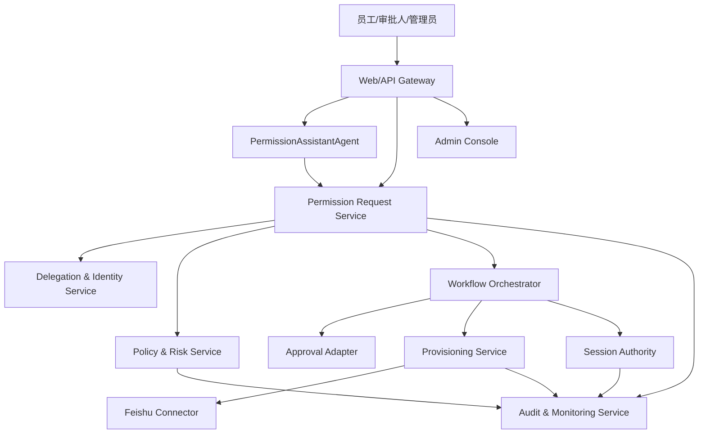
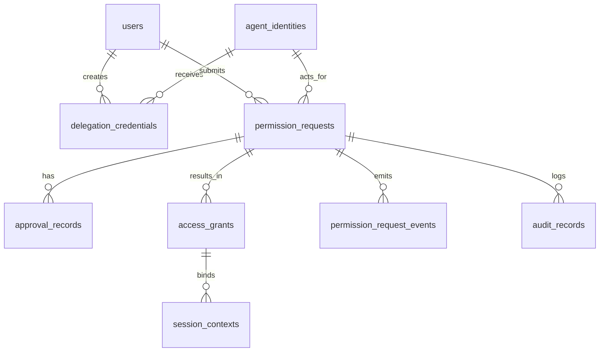
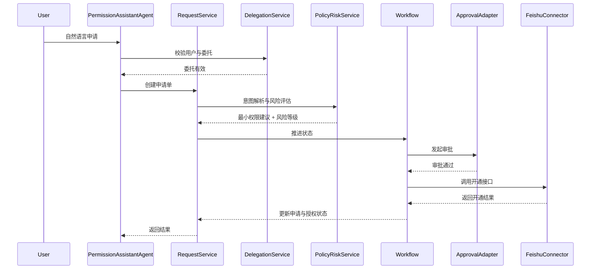

# 技术设计文档（TDD）

## 给 AI 发通行证：Agent 身份与权限系统 V1

> 文档状态：`Frozen`
> 冻结日期：`2026-04-16`
> 冻结说明：本文档已作为 V1 开发基线冻结。自本次冻结起，不再直接修改；后续开发任务拆解、实施记录与阶段验收统一维护在执行类文档中。

## 1. 文档目的

本文档基于以下输入文档展开：

- 产品需求文档：`docs/agent-identity-permission-prd.md`
- 软件需求规格说明书：`docs/agent-identity-permission-srs.md`

本文档用于回答“系统如何实现”，重点覆盖以下内容：

- 平台一期的总体技术架构。
- 核心模块划分与职责边界。
- 关键业务流程的实现路径。
- 数据模型与核心接口设计。
- 会话治理、风险评估、自动开通、审计留痕等关键设计决策。
- 异常处理、可观测性和阶段实施建议。

本文档以平台一期为边界，不覆盖多 Agent 协同编排、跨组织联合治理和 DID/VC 正式落地方案。

## 2. 设计输入与约束

### 2.1 来自 PRD 的约束

- 平台一期只存在 1 个显式用户侧 Agent，即“权限自助服务 Agent”。
- 平台一期聚焦飞书审批与飞书文档/报表类只读权限开通。
- 产品核心闭环为：自然语言申请 -> 最小权限建议 -> 风险分级 -> 审批 -> 自动开通 -> 续期/回收 -> 审计。
- 核心用户包括普通员工、审批人、IT/系统管理员、安全管理员。

### 2.2 来自 SRS 的约束

- 最小授权单位为“主体 + 凭证 + 资源 + 动作 + 时效”。
- 动态授权底座仍然以任务状态驱动为核心。
- 审批通过不等于权限已生效，连接器生效结果必须单独回写。
- 高风险动作必须执行前授权。
- 任何身份、委托、审批、会话状态不可判定时，默认不放行高风险动作。

### 2.3 技术假设

- 企业已有 IAM/SSO，可提供用户身份认证和组织信息同步。
- 飞书审批和飞书权限接口可用，具备回调和 API 调用能力。
- V1 可接受“逻辑服务拆分 + 物理上模块化单体/单仓服务”的实现方式，不要求一开始就拆成大量微服务。
- LLM 可用于意图解析和辅助解释，但安全决策不能只依赖 LLM。

## 3. 核心设计决策

### 3.1 架构决策 1：V1 采用“1 个主 Agent + 7 个治理服务模块”

平台一期不设计多个业务 Agent，而是围绕一个用户侧 `PermissionAssistantAgent` 展开。审批、策略、连接器、会话治理、审计等能力以服务模块存在，而不都被建模成 Agent。

这样做的原因：

- 更符合 PRD 的 V1 产品边界。
- 便于控制复杂度，快速做出端到端 PoC。
- 有利于将“产品形态”和“治理底座”清晰分层。
- 后续若引入更多 Agent，可直接复用同一套身份、委托、授权与会话治理能力。

### 3.2 架构决策 2：逻辑分层清晰，物理实现优先模块化单体

V1 推荐采用“模块化单体 + 后台异步 worker + 外部连接器”的部署方式。

原因如下：

- 当前闭环较短，过早拆成微服务会增加部署和事务复杂度。
- 状态机、审计链、补偿和回调处理需要强一致主存储，单体更容易落地。
- 通过清晰模块边界和内部接口，后续可逐步拆分为独立服务。

### 3.3 架构决策 3：关键安全决策采用“规则引擎优先，LLM 辅助”

平台中的关键授权点包括：

- 意图解析后的最小权限映射。
- 风险分级。
- 审批链路决定。
- 开通前二次校验。
- 高风险工具的执行前授权。

其中：

- LLM 负责自然语言解析、语义补全和解释生成。
- 规则引擎负责最小权限映射、风险分级、审批升级和放行判定。
- 安全推理引擎负责聚合上下文并输出最终裁决，但不允许仅由大模型直接决定是否放行。

### 3.4 架构决策 4：统一状态机驱动申请生命周期

V1 采用显式状态机驱动整个权限申请生命周期，避免以“流程散落在多个模块”实现。

至少统一以下状态：

- 权限申请状态。
- 审批状态。
- 授权状态。
- 任务状态。
- 会话状态。

所有核心模块都围绕状态变更工作，并通过审计事件关联。

## 4. 总体架构

### 4.1 逻辑架构图



### 4.2 物理部署建议

V1 推荐拆为以下运行单元：

- `app-service`：承载 Gateway、Permission Request、Delegation、Policy、Workflow、Audit 的主应用。
- `worker-service`：承载异步任务，包括审批回调处理、开通重试、到期提醒、回收、补偿。
- `connector-feishu`：飞书审批和权限开通适配器，可独立部署。
- `postgres`：主存储。
- `redis`：缓存、幂等键、会话状态热点数据、分布式锁。

### 4.3 边界原则

- 所有用户请求必须先进入 Gateway，再进入主应用。
- 所有连接器调用必须经过 Workflow 和 Provisioning Service，不允许 Agent 直接调用外部系统。
- 所有安全裁决必须经过 Policy & Risk Service，不允许由 Agent 直接跳过。
- 所有状态变化必须写审计日志。

## 5. 核心模块设计

## 5.1 Gateway / BFF

### 职责

- 为员工、审批人、IT 管理员、安全管理员提供统一 API 入口。
- 对接企业 IAM/SSO。
- 注入用户上下文、组织上下文和会话上下文。
- 做基础限流、鉴权、审计入口记录。

### 不负责

- 不负责业务意图解析。
- 不负责风险分级和授权决策。
- 不负责连接器执行。

### 核心输入输出

- 输入：登录态、自然语言请求、后台查询请求、审批操作。
- 输出：请求受理结果、当前状态、查询结果。

## 5.2 PermissionAssistantAgent

### 职责

- 接收用户自然语言输入。
- 调用意图解析流程，生成结构化申请。
- 在信息不全时生成澄清问题。
- 以业务语言向用户解释系统建议。
- 在续期场景中复用历史申请上下文。

### 设计要求

- Agent 只负责交互、理解和编排，不拥有直接开通权限。
- Agent 必须带 `agent_id` 参与后续所有调用。
- Agent 调用所有后端动作时都必须附带用户委托上下文。

### 关键输入

- `user_message`
- `user_context`
- `agent_id`
- `conversation_id`

### 关键输出

- `structured_request`
- `clarification_questions`
- `human_readable_explanation`

## 5.3 Permission Request Service

### 职责

- 创建和维护 `PermissionRequest`。
- 驱动申请状态机。
- 保存原始文本、结构化字段、建议权限和关联凭证。
- 统一管理“申请单”这一核心业务对象。

### 状态归属

以下状态以此模块为主控：

- `Draft`
- `Submitted`
- `Evaluating`
- `PendingApproval`
- `Approved`
- `Provisioning`
- `Active`
- `Expiring`
- `Expired`
- `Revoked`
- `Failed`

### 核心设计点

- 每个申请单必须保存原始用户输入和结构化解析结果，方便后续审计和复评。
- 每个状态切换必须带 `event_type` 和 `operator_type`。
- 申请单是审批、开通、续期、撤销的统一主键索引。

## 5.4 Delegation & Identity Service

### 职责

- 管理用户身份映射、Agent 身份和委托凭证。
- 校验用户是否有资格委托权限自助服务 Agent。
- 生成 `DelegationCredential`。
- 提供委托有效性校验。

### V1 范围

- 只支持“用户 -> 权限自助服务 Agent”的单层委托。
- 不支持多级 Agent 再委托。

### 关键校验

- 用户身份是否有效。
- Agent 是否启用。
- 委托范围是否匹配当前任务。
- 委托是否过期、撤销或失效。

## 5.5 Policy & Risk Service

### 职责

- 将结构化申请映射为最小权限建议。
- 计算风险等级。
- 决定审批链。
- 在开通前做二次校验。
- 对高风险动作执行 action authorization。

### 内部子模块

- `Intent Mapper`：资源、动作、时效映射。
- `Permission Mapper`：业务意图 -> 最小权限项。
- `Risk Engine`：风险打分和等级判定。
- `Policy Decision Point`：最终放行/拒绝/升级审批/人工复核决策。

### 决策顺序

1. 资源识别。
2. 动作识别。
3. 资源-动作可行性校验。
4. 最小权限建议生成。
5. 风险评分。
6. 审批链路确定。
7. 开通前二次校验。

### 关键设计点

- 风险分级必须以规则为主，不允许完全依赖模型打分。
- 所有决策必须带 `policy_version`。
- 对“只看不改”这类请求，系统应优先生成只读权限，而不是角色级大授权。

## 5.6 Workflow Orchestrator

### 职责

- 承接申请单状态机和任务状态机。
- 编排评估、审批、开通、续期、回收、撤销流程。
- 创建异步任务并处理回调事件。

### 内部事件

- `request.submitted`
- `request.evaluated`
- `approval.required`
- `approval.approved`
- `approval.rejected`
- `grant.provisioning_requested`
- `grant.provisioned`
- `grant.provision_failed`
- `grant.expiring`
- `grant.expired`
- `grant.revoked`

### 设计要求

- 所有外部回调必须先落库再驱动状态迁移。
- 同一申请单的状态变更必须串行处理，防止并发更新。
- 采用幂等事件处理机制，避免审批回调重复生效。

## 5.7 Approval Adapter

### 职责

- 根据审批链配置向飞书发起审批。
- 接收并校验飞书回调。
- 将外部审批状态映射为内部审批状态机。

### 关键设计点

- 回调必须校验签名、请求来源和幂等键。
- 审批通过后仅更新内部 `approval_status=Approved`，不得直接把申请状态置为 `Active`。
- 审批撤回、超时、驳回都要进入明确状态。

## 5.8 Provisioning Service & Feishu Connector

### 职责

- 根据批准结果调用飞书接口开通权限。
- 在续期时更新有效期。
- 在回收和撤销时删除权限。
- 回写执行结果、失败原因和对账状态。

### 设计要求

- 所有开通请求都必须带上 `request_id`、`grant_id`、`policy_version`、`delegation_id`。
- 对飞书接口返回“受理成功”与“实际生效成功”要区分建模。
- 对失败结果支持重试、补偿和人工介入。

### V1 接入范围

- 飞书审批。
- 飞书文档/报表类只读权限。

## 5.9 Session Authority

### 职责

- 管理 `global_session_id`。
- 维护 Agent 会话、任务会话、协议会话和连接器会话的映射。
- 接收撤销、停用、过期等事件，广播状态变更。

### 关键设计点

- V1 不要求接入所有协议，但内部模型必须能表达跨协议撤销。
- 任何高风险调用在执行前都必须检查当前会话是否被撤销。
- 撤销失败应进入 `SyncFailed` 状态并持续重试。

## 5.10 Audit & Monitoring Service

### 职责

- 统一记录审计事件。
- 维护业务指标和安全指标。
- 提供管理员查询和告警能力。

### 审计主线

- 谁提交了申请。
- 哪个 Agent 代表谁代办。
- 如何被解析成最小权限。
- 风险等级是什么。
- 谁审批通过或拒绝。
- 是否开通成功。
- 何时续期、何时回收、何时撤销。

### 关键设计点

- 审计写入失败不能影响主交易提交，但必须保证异步补写和告警。
- 高风险事件应支持主动告警。

## 6. 数据设计

## 6.1 核心表

V1 建议落以下核心表：

- `users`
- `agent_identities`
- `delegation_credentials`
- `permission_requests`
- `permission_request_events`
- `approval_records`
- `access_grants`
- `session_contexts`
- `policy_rules`
- `risk_rules`
- `audit_records`
- `connector_tasks`

## 6.2 核心关系



## 6.3 关键对象设计

### 6.3.1 permission_requests

核心字段建议：

- `request_id`
- `user_id`
- `agent_id`
- `delegation_id`
- `raw_text`
- `resource_key`
- `resource_type`
- `action`
- `constraints_json`
- `requested_duration`
- `suggested_permission`
- `risk_level`
- `approval_status`
- `grant_status`
- `request_status`
- `current_task_state`
- `policy_version`
- `created_at`
- `updated_at`

### 6.3.2 access_grants

核心字段建议：

- `grant_id`
- `request_id`
- `resource_key`
- `action`
- `effective_at`
- `expire_at`
- `grant_status`
- `connector_status`
- `reconcile_status`
- `revoked_at`

### 6.3.3 session_contexts

核心字段建议：

- `global_session_id`
- `request_id`
- `agent_id`
- `user_id`
- `task_session_id`
- `connector_session_ref`
- `session_status`
- `revocation_reason`
- `last_sync_at`

### 6.3.4 audit_records

核心字段建议：

- `audit_id`
- `request_id`
- `event_type`
- `actor_type`
- `actor_id`
- `subject_chain`
- `result`
- `reason`
- `metadata_json`
- `created_at`

## 6.4 存储策略

- PostgreSQL 作为强一致主存储。
- 审计和事件表采用时间分区或归档策略。
- Redis 存储热点会话状态、幂等键和短期缓存。

## 7. API 设计

## 7.1 提交申请

`POST /permission-requests`

请求示例：

```json
{
  "message": "我需要查看销售部Q3报表，但不需要修改权限",
  "agent_id": "agent_perm_assistant_v1",
  "delegation_id": "dlg_123"
}
```

响应示例：

```json
{
  "request_id": "req_123",
  "status": "Submitted",
  "next_action": "Evaluating"
}
```

## 7.2 评估申请

`POST /permission-requests/{id}/evaluate`

响应至少返回：

- 资源识别结果
- 动作识别结果
- 时效建议
- 最小权限建议
- 风险等级
- 是否需要审批

## 7.3 审批回调

`POST /approvals/callback`

必须包含：

- `approval_id`
- `external_instance_id`
- `result`
- `signature`
- `event_time`
- `idempotency_key`

## 7.4 执行开通

`POST /grants/{id}/provision`

必须在服务端校验：

- `request_status == Approved`
- `approval_status == Approved`
- `delegation valid`
- `session not revoked`
- `action within suggested_permission`

## 7.5 发起续期

`POST /grants/{id}/renew`

设计要求：

- 创建新的续期评估事件。
- 默认继承原资源和动作，但重新评估时效与风险。

## 7.6 发起撤销

`POST /grants/{id}/revoke`

设计要求：

- 撤销必须同步更新 `access_grants` 和 `session_contexts`。
- 若连接器侧撤销失败，状态置为 `Revoking/SyncFailed`。

## 8. 关键流程设计

## 8.1 申请与开通流程



## 8.2 续期流程

1. 定时任务扫描 `expire_at` 即将到期的 `access_grants`。
2. 生成提醒事件并通知用户。
3. 用户发起续期。
4. 系统复用原申请信息并重新进入评估流程。
5. 若风险等级不变且策略允许，可走简化审批；否则重新走完整审批。
6. 续期成功后更新 `access_grants.expire_at`。

## 8.3 紧急撤销流程

1. 安全管理员停用 Agent 或发起指定授权撤销。
2. Session Authority 将相关会话置为 `Revoking`。
3. Workflow 停止后续开通/续期动作。
4. Provisioning Service 调用连接器执行撤销。
5. 全部成功后会话状态进入 `Revoked`，否则进入 `SyncFailed` 并重试。

## 9. 安全设计

## 9.1 身份与凭证

- 用户身份由企业 IAM/SSO 提供。
- Agent 身份由平台注册并签发内部身份记录。
- 委托凭证采用平台签名结构，包含用户、Agent、资源范围、动作范围和时效。
- 审批结果必须绑定到申请单和委托上下文，不能脱离原申请重放。

## 9.2 Prompt Injection 防护

- Agent 输出不能直接驱动高风险动作。
- 所有结构化结果必须经过规则和策略校验。
- 外部文档内容和工具返回不得直接覆盖系统策略。
- 对用户文本和外部文档做“指令/数据”边界隔离。

## 9.3 最小权限保障

- 权限映射优先资源级 scope。
- 默认只读优先。
- 长期授权默认不推荐。
- 所有开通前进行二次校验。

## 9.4 幂等与防重放

- 审批回调必须带幂等键。
- 开通任务必须使用 `grant_id` 做幂等控制。
- 撤销任务必须使用 `global_session_id` 做幂等控制。

## 9.5 审计防篡改

- 审计记录必须只追加写入。
- 对关键事件记录摘要签名或哈希链。
- 审批、撤销、紧急停用等关键动作必须保留前后态。

## 10. 异常处理设计

| 场景 | 处理策略 |
| --- | --- |
| 资源识别失败 | 进入待补充信息状态，不进入审批 |
| 风险服务超时 | 默认高风险处理或挂起 |
| 审批接口不可用 | 申请停留在 `PendingApproval` 前的待提交状态并告警 |
| 审批回调重复 | 按幂等键忽略重复处理 |
| 飞书开通失败 | 进入 `Failed`，触发补偿任务和 ITAdmin 待办 |
| 会话撤销失败 | 进入 `SyncFailed` 并持续重试 |
| 审计写入失败 | 本地缓冲 + 异步补写 + 告警 |

## 11. 可观测性设计

## 11.1 核心指标

- 请求提交量
- 解析成功率
- 风险分级分布
- 审批通过率
- 自动开通成功率
- 续期成功率
- 到期回收率
- 撤销传播成功率
- 平均处理时长

## 11.2 关键日志

- 申请创建日志
- 风险评估日志
- 审批回调日志
- 连接器执行日志
- 会话撤销日志
- 异常补偿日志

## 11.3 告警项

- 高风险申请未进入审批
- 审批通过但开通失败
- 开通成功但回写失败
- 撤销传播超时
- 高频异常申请

## 12. 实施建议

## 12.1 开发顺序

1. `PermissionRequest + Workflow` 主链路。
2. `Delegation & Identity`。
3. `Policy & Risk` 最小可用规则集。
4. `Approval Adapter`。
5. `Provisioning Service + Feishu Connector`。
6. `Session Authority`。
7. `Audit & Monitoring`。

## 12.2 V1 最小可运行切片

建议先交付如下最小切片：

- 员工输入自然语言。
- 系统解析为“文档只读权限申请”。
- 发起飞书审批。
- 审批通过后自动开通飞书只读权限。
- 写入到期时间。
- 支持管理员查看申请与授权状态。

## 12.3 后续扩展方向

- 编辑类权限治理。
- 多资源连接器扩展。
- 更细粒度的策略引擎。
- 多 Agent 协同与多级委托。
- DID/VC 兼容层。

## 13. 当前未决事项

以下事项需在详细设计或实施前确认：

- 飞书资源模型中“报表”与“文档”的具体权限映射表。
- 低风险是否允许全自动批准。
- 续期是否允许沿用原审批人链路。
- 资源目录服务由平台维护还是从外部系统同步。
- ITAdmin 是否需要单独的异常补偿控制台。
